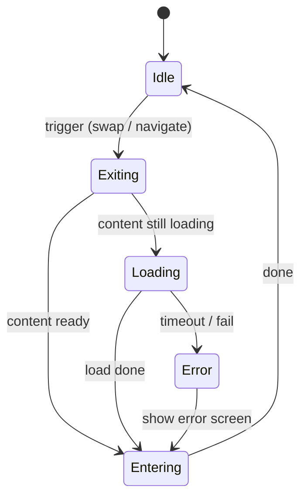
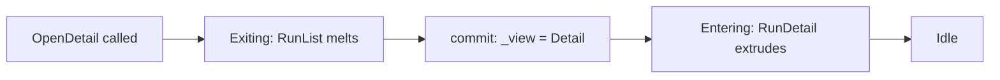
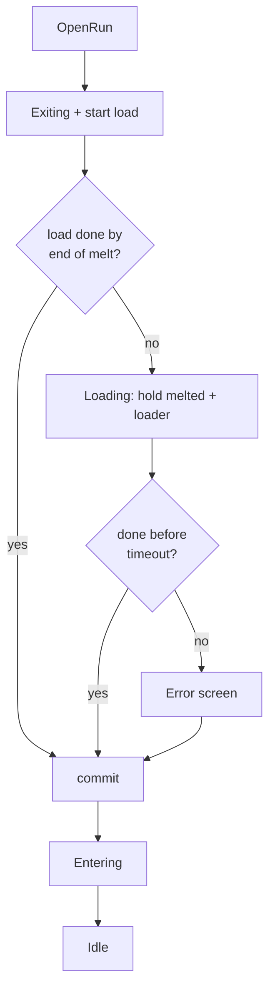
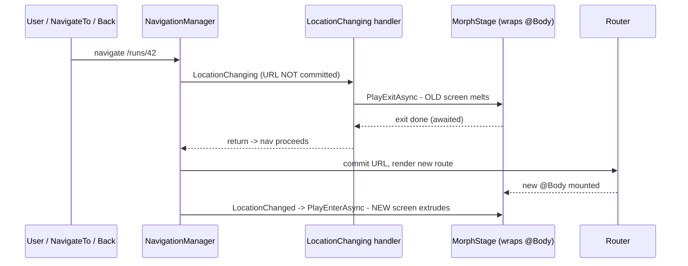

# Animation / Routing / UI Foundation — Implementation Plan

> **What this is.** A phased plan for a **reusable foundation library** ("Morph")
> that provides the animation engine, the screen-transition/routing integration,
> and the base **shape** components every screen is built from. It is
> **domain-agnostic**: no DTOs, no flow/run specifics. The current product
> (`RemoteAgents.Web`) is the *first consumer* and must drop onto it cleanly, but
> nothing here is specific to it.
>
> **Grounding.** Every mechanism below was de-risked on 2026-06-09 (see
> [[transition-engine-validation]] and `research/transition-*`,
> `spikes/probe-depth`, `spikes/probe-router`). Both core assumptions PASSED in
> pure CSS + C# with **zero JS interop**; prior art confirmed **build-our-own**.

---

## 1. Identity & scope

**Morph** = a theme-agnostic Blazor WASM library offering:

1. **Shapes** — base container components that *own their transition*. Callers
   pour content in; they never write animation.
2. **Depth-layered staggering** — nested shapes animate in bands by nesting depth.
3. **A transition registry** — animation *types* are data, not code branches.
4. **An async-capable orchestrator** — `exit → (await load) → enter`, with
   minimum-duration floors, a render barrier, and reduced-motion handling.
5. **Router integration** — the same transition across real, deep-linkable routes.

**Out of scope (deliberately):** any domain model, any concrete screen, any DTO.
The neumorphic look is *one theme* layered on top — swappable, not baked into the
motion core.

**Non-goal / YAGNI guardrails.** No speculative abstractions. The one place we
plan an explicit seam (the motion backend) is justified by a *named* open
decision (pure-CSS vs JS engine) and is introduced only on the second driver —
until then the motion step is merely *isolated*, not interfaced.

---

## 2. Vocabulary (the concepts, locked by validation)

| Term | Meaning |
|------|---------|
| **Stage** | A transitioning region. Owns phase state + drives the orchestrator. One wraps the route body; others can wrap any swappable region. |
| **Shape** | A morph-capable container component (`NeuCard`, `NeuWell`, `MorphItem`). Knows its **depth**. Owns the animation contract. |
| **Depth / Layer** | Nesting depth → animation band. `--depth` is written **inline at render time** (validated: this is what prevents the layer-0 flash). |
| **TransitionDefinition** | Data describing one animation *type* (exit/enter keyframe names + timing). Lives in a registry. |
| **Orchestrator** | The async phase machine: `Idle → Exiting → (Loading) → Entering → Idle` (+ error). |
| **MotionOptions** | The runtime knobs (preset, reduced-motion, floors, timeout). |

---

## 3. Project layout

A **Razor Class Library** `src/Morph/` (RCL = ships components *and* bundled CSS),
referenced by `RemoteAgents.Web`. An assembly boundary is justified here because
it *earns reuse* (per the repo's assembly rule).

```
src/Morph/
  Core/
    MorphStage.razor          // the transitioning region; owns phase + orchestrator
    MorphStageController.cs    // the async phase machine (no UI)
    MorphShapeBase.cs          // base class every shape inherits
    MorphContext.cs            // cascaded: hands out depth, tracks max depth
    TransitionDefinition.cs    // record: one animation type as data
    Transitions.cs             // the registry (Morph, Slide, …)
    MotionOptions.cs           // knobs
    MorphRouting.cs            // LocationChanging hook → drives a MorphStage
  Shapes/
    NeuCard.razor              // raised container (the workhorse)
    NeuWell.razor              // inset container
    MorphItem.razor            // unstyled participant (one-offs)
  wwwroot/
    morph.css                  // motion: keyframes + stage rules (theme-agnostic)
    neu.css                    // theme: tokens + .neu-raised/.neu-inset primitives
```

The split is the point: **`morph.css` is the engine, `neu.css` is a skin.** A
different look = a different theme file; the motion core is untouched.

---

## 4. Control knobs

| Knob | Where | Default | Effect |
|------|-------|---------|--------|
| `Transition` (type) | per-`MorphStage` (or per-shape override) | `Transitions.Morph` | which keyframe pair + timing drives exit/enter |
| `Preset` (motion feel) | `MotionOptions` | `Smooth` | duration/ease/stagger bundle (Snappy/Smooth/Bouncy) |
| `LayerInterval` | `TransitionDefinition` | 140 ms | gap between depth bands (the ripple speed) |
| `Exit/EnterMs` | `TransitionDefinition` | 420 / 480 | base phase durations |
| `MinExitMs` (floor) | `MotionOptions` | = ExitMs | fast loads still feel intentional, no flash |
| `LoadTimeout` | `MotionOptions` | 10 s | async-gate budget → error path on expiry |
| `ReducedMotion` | `MotionOptions` | auto | skips CSS anim **and** the C# awaits |
| per-shape extra anim | inline on a shape | none | a component adds its own animation *on top* (disjoint-property contract) |

---

## 5. Extension points

| To add… | You do | Touches existing code? |
|---------|--------|------------------------|
| **A new animation type** (slide, flip, dissolve) | add one keyframe pair to `morph.css` + one `TransitionDefinition` to the registry | **No** — pure addition |
| **A new shape** (e.g. `NeuPanel`) | a component inheriting `MorphShapeBase` | No |
| **A new theme** (dark, flat, glass) | a CSS token/primitive file; motion core unchanged | No |
| **A new async source** | pass any `Func<Task>` load delegate to the stage | No |
| **A JS motion backend** (GSAP/Motion) | introduce `IMotionDriver`, implement a JS driver; default stays CSS | Only on this *second* driver (YAGNI) |

---

## 6. Key types (illustrative sketches — not final code)

### 6.1 `MorphShapeBase` — shapes inherit this; it hides the animation

```csharp
public abstract class MorphShapeBase : ComponentBase
{
    [CascadingParameter] protected MorphContext Context { get; set; } = MorphContext.Detached;

    // Per-shape opt-out / override knobs:
    [Parameter] public bool Participates { get; set; } = true;
    [Parameter] public TransitionDefinition? Transition { get; set; }   // null = inherit stage's

    protected int Depth { get; private set; }

    protected override void OnInitialized()
    {
        Depth = Context.NextDepth();          // structural: parent depth + 1
        Context.ReportDepth(Depth);            // feeds max-depth → orchestrator wait
    }

    // Written INLINE on the root element at render time (validated: prevents flash).
    protected string RootStyle =>
        $"--depth:{Depth};{(Transition is { } t ? t.AsVars() : "")}";

    protected string RootClass =>
        Participates ? "morph-item" : "";
}
```

> A new shape is now trivial and automatically correct — it inherits depth,
> participation, and the per-shape override seam for free.

### 6.2 A concrete shape — how little it takes

```razor
@inherits MorphShapeBase
<div class="neu-raised morph-card @RootClass" style="@RootStyle">
    <CascadingValue Value="Context.Child(Depth)">@ChildContent</CascadingValue>
</div>
@code { [Parameter] public RenderFragment? ChildContent { get; set; } }
```

> The `CascadingValue` is what makes a card-inside-a-card become depth N+1 — the
> ripple falls out of the component tree, no manual numbering.

### 6.3 `TransitionDefinition` + registry — animation types as data

```csharp
public sealed record TransitionDefinition(
    string Name,
    string ExitKeyframes,    // CSS @keyframes name
    string EnterKeyframes,
    int    ExitMs,
    int    EnterMs,
    int    LayerInterval,
    string Ease)
{
    public string AsVars() =>
        $"--anim-exit:{ExitKeyframes};--anim-enter:{EnterKeyframes};" +
        $"--exit-dur:{ExitMs}ms;--enter-dur:{EnterMs}ms;" +
        $"--layer-interval:{LayerInterval}ms;--ease:{Ease};";
}

public static class Transitions
{
    public static readonly TransitionDefinition Morph = new(
        "morph", "morph-exit", "morph-enter", 420, 480, 140,
        "cubic-bezier(0.22,1,0.36,1)");

    // Extension point: a new type is one entry + one keyframe pair. No branches.
    public static readonly TransitionDefinition Slide = new(
        "slide", "slide-exit", "slide-enter", 300, 340, 90,
        "cubic-bezier(0.4,0,0.2,1)");
}
```

### 6.4 `MorphStageController` — the async phase machine (the heart)

```csharp
public enum MorphPhase { Idle, Exiting, Loading, Entering }

public sealed class MorphStageController(MotionOptions options)
{
    public MorphPhase Phase { get; private set; } = MorphPhase.Idle;
    public event Func<Task>? StateChanged;        // stage subscribes → StateHasChanged + render barrier

    // load:  optional async content fetch (any Task, no DTO knowledge)
    // commit: swap the rendered content (navigate, or flip a view field)
    public async Task RunAsync(TransitionDefinition t, int maxDepth,
                               Func<Task>? load, Func<Task> commit)
    {
        if (Phase != MorphPhase.Idle) return;      // re-entrancy guard (validated requirement)
        if (options.ReducedMotion) { await (load?.Invoke() ?? Task.CompletedTask); await commit(); return; }

        var exitSpan = t.ExitMs + maxDepth * t.LayerInterval;
        var enterSpan = t.EnterMs + maxDepth * t.LayerInterval;

        // Start the load DURING the exit — the melt window is free.
        var loading = load?.Invoke() ?? Task.CompletedTask;

        await SetPhase(MorphPhase.Exiting);        // render barrier inside SetPhase
        await Task.Delay(exitSpan);                // min-exit floor lives here

        if (!loading.IsCompleted)                  // async gate: rest "melted" until ready
        {
            await SetPhase(MorphPhase.Loading);
            await WithTimeout(loading, options.LoadTimeout);   // → error view on timeout
        }

        await commit();                            // content swaps while stage is empty
        await SetPhase(MorphPhase.Entering);
        await Task.Delay(enterSpan);
        await SetPhase(MorphPhase.Idle);
    }

    private async Task SetPhase(MorphPhase p)
    {
        Phase = p;
        if (StateChanged is { } h) await h();       // stage completes a TCS in OnAfterRender (no rAF, hold TCS in local)
    }
}
```

> Control knobs visible here: `ReducedMotion` short-circuits *both* visuals and
> awaits; the min-floor is the `exitSpan` delay; the async gate + timeout are the
> `Loading` branch. Extension: `load` is any `Task` — DTOs never appear.

### 6.5 Router integration — same transition across real routes

```csharp
public sealed class MorphRouting(NavigationManager nav) : IDisposable
{
    private IDisposable? _reg;
    public void Attach(Func<string, Task> drive) =>
        _reg = nav.RegisterLocationChangingHandler(async ctx =>
        {
            // melt the OLD content before the URL commits; back/forward included (validated)
            await drive(ctx.TargetLocation);
        });
    public void Dispose() => _reg?.Dispose();
}
```

> Validated on .NET 10 WASM for link, programmatic, **and** browser back/forward.
> The orchestrator's re-entrancy guard + a same-URL no-op are the required guards.

---

## 7. CSS convention (how types stay data, not branches)

```css
/* morph.css — the stage reads the chosen type from inline vars; it never names a type */
.stage[data-phase="exit"]  .morph-item {
    animation: var(--anim-exit)  var(--exit-dur)  var(--ease) forwards;
    animation-delay: calc(var(--depth, 0) * var(--layer-interval));
}
.stage[data-phase="enter"] .morph-item {
    animation: var(--anim-enter) var(--enter-dur) var(--ease) backwards; /* backwards = no flash */
    animation-delay: calc(var(--depth, 0) * var(--layer-interval));
}

/* A new TYPE is a self-contained keyframe pair — adding it touches nothing else. */
@keyframes morph-exit  { from { box-shadow: 6px 6px 14px var(--sd), -6px -6px 14px var(--sl); }
                         to   { box-shadow: 0 0 0 transparent, 0 0 0 transparent; opacity:0; transform:scale(.95) } }
@keyframes morph-enter { from { opacity:0; transform:scale(.93) } to { box-shadow: 6px 6px 14px var(--sd), -6px -6px 14px var(--sl) } }

@media (prefers-reduced-motion: reduce) { .stage .morph-item { animation: none } }
```

**Disjoint-property contract (the one real risk).** Base keyframes own
`transform / opacity / box-shadow`. A per-component extra animation must animate
*other* properties (`filter`, `color`, …). Same-property collisions resolve
silently by last-declared-wins — so this contract is documented and, ideally,
lint-checked.

---

## 8. Phased build plan (walking-skeleton; one commit + verify per phase)

| Phase | Deliverable | Done-when |
|-------|-------------|-----------|
| **0 — Skeleton** | RCL `src/Morph/` created, referenced by `RemoteAgents.Web`; `neu.css` + `morph.css` move in as the theme + engine layers. | Web app references Morph and renders a `.neu-raised` element. Warning-free build. |
| **1 — Shapes + depth** | `MorphShapeBase`, `MorphContext` (cascaded depth), `NeuCard`/`NeuWell`/`MorphItem`. No motion yet (static). | Nested shapes render correct inline `--depth` (verified in DOM). |
| **2 — Stage + orchestrator (in-page)** | `MorphStage`, `MorphStageController`, the `Morph` `TransitionDefinition`, render barrier, depth-banded wait. In-page swap, no router. | In-page swap melts/extrudes by depth; **Playwright contact-sheet shows no flash**. |
| **3 — Router** | `MorphRouting` hook drives a `MorphStage` across ≥2 real routes; re-entrancy + same-URL + reduced-motion guards. | Link / programmatic / back / forward all animate (re-confirm the probe result in the lib). |
| **4 — Registry + extensibility** | Generalize to the `Transitions` registry; split phase (exit/enter) from type; add `Slide` to prove the seam; per-shape override + disjoint-property contract. | Toggling type swaps the animation with **no new branch**; one card composes an extra. |
| **5 — Async gate** | The `Loading` phase: load concurrent with exit, melted resting state + loader slot, min-floor, timeout/error path. Wired to a generic `Func<Task>` load. | Fast load looks unchanged; slow load rests then enters; failed load enters an error state. |
| **6 — Adoption seam** | Show `RemoteAgents.Web` plugging in: a `MorphStage` wraps `@Body`; nav links drive it; an existing page renders its content inside shapes. **No DTO work.** | One real page (e.g. `/runs`) renders through Morph end-to-end against the live Host. |

Verification throughout uses the Playwright capture/record harness (the in-tool
preview is blind to these animations — hidden document). Each phase: warning-free
build, green tests where applicable, motion verified by contact sheet, one commit.

---

## 9. Open decisions (carry into the build, don't pre-bake)

- **D-A. Motion backend.** Default = pure CSS (validated sufficient). Keep the
  motion step *isolated*; introduce `IMotionDriver` only if/when a JS engine
  (GSAP/Motion) earns its place for a type CSS can't express. (Don't build the
  interface yet — YAGNI.)
- **D-B. Reduced-motion detection.** `ReducedMotion=auto` needs one `matchMedia`
  read — the single unavoidable interop. Acceptable as a one-shot at stage init,
  or expose as a pure config flag. Decide at Phase 3.
- **D-C. Exit order.** Default innermost-first melt (reads as physical, validated).
  Confirm whether any screen wants same-order exit.
- **D-D. Theme packaging.** `neu.css` ships inside Morph for now; split into a
  separate theme package only on the second theme.

---

## 10. How it works — use cases & flows

Walkthrough of the runtime behaviour, one concrete use case at a time. These are
the "why" behind §6; read them together.

### 10.1 Why an orchestrator exists at all

A screen swap is **not atomic**. Three facts force a coordinator:

1. The **old** content must animate *out* **before** it is removed from the DOM.
2. The **new** content must **exist** in the DOM before it can animate *in*.
3. If the new content loads async, we must **not** show an empty/half-loaded screen.

Blazor on its own diffs-and-replaces instantly — no exit animation, and it will
render a blank screen mid-load. So something sits in the middle and **sequences
across time**: exit → wait → swap → enter. That sequencing (with `await`s) is the
orchestration.



### 10.2 The core loop (the whole engine)

```csharp
public async Task RunAsync(
    TransitionDefinition t,     // WHICH animation (knob)
    int maxDepth,               // deepest nested layer → how long the ripple lasts
    Func<Task>? load,           // OPTIONAL async work (any Task — no DTO knowledge)
    Func<Task> commit)          // REQUIRED: actually swap what's on screen
{
    if (Phase != MorphPhase.Idle) return;            // (1) guard overlapping triggers

    if (_options.ReducedMotion) {                     // (2) a11y: skip animation AND waits
        if (load is not null) await load();
        await commit(); return;
    }

    int exitSpan  = t.ExitMs  + maxDepth * t.LayerInterval;   // last layer finishes last
    int enterSpan = t.EnterMs + maxDepth * t.LayerInterval;

    var loading = load?.Invoke() ?? Task.CompletedTask;       // (3) START load NOW (during the melt)

    await SetPhase(MorphPhase.Exiting);               // (4) CSS melts the OLD content
    await Task.Delay(exitSpan);                       //     min floor: exit always takes >= this

    if (!loading.IsCompleted) {                        // (5) not loaded yet? rest "melted"
        await SetPhase(MorphPhase.Loading);
        await WithTimeout(loading, _options.LoadTimeout);  // -> throws -> caller shows error
    }

    await commit();                                   // (6) swap content while stage is EMPTY
    await SetPhase(MorphPhase.Entering);              // (7) CSS extrudes the NEW content
    await Task.Delay(enterSpan);
    await SetPhase(MorphPhase.Idle);                  // (8) done
}
```

The one subtle line is `SetPhase` — it is **why the animation never gets clipped**:

```csharp
private async Task SetPhase(MorphPhase phase)
{
    Phase = phase;                               // flip C# state
    var barrier = new TaskCompletionSource();     // HOLD IN LOCAL (re-entrancy bug lesson)
    _barrier = barrier;
    await _notify();                              // stage calls StateHasChanged()
    await barrier.Task;                           // wait until the DOM actually committed
}
// MorphStage.razor:  protected override void OnAfterRender(bool _) => _controller.ReleaseBarrier();
```

> Without the barrier we set `data-phase="exit"` then immediately `Task.Delay` —
> but the CSS class may not be in the DOM yet, so the browser never plays the
> melt. The barrier guarantees the class is live *before* we count time. (This is
> the exact render-barrier trap the spike hit: hold the TCS in a local, no rAF.)

### 10.3 Basic transition — "unload this, load that" (in-page)

`commit` is just "flip what's rendered"; Blazor mounts/unmounts from the field.

```razor
<MorphStage @ref="_stage" Transition="Transitions.Morph">
    @if (_view == View.List) { <RunList /> }
    else                      { <RunDetail Run="_open" /> }
</MorphStage>

@code {
    MorphStage _stage = default!;
    View _view = View.List;

    Task OpenDetail(RunVm r) => _stage.RunAsync(        // "close this, open that", no async
        load:   null,
        commit: () => { _open = r; _view = View.Detail; return Task.CompletedTask; });
}
```



### 10.4 Async-gated — "do something, load content, wait, then continue"

Same call — just pass a `load`. The melt window hides the fetch, so a fast load
adds **zero** visible wait.

```csharp
Task OpenRun(Guid id) => _stage.RunAsync(
    load:   async () => _open = await Api.GetRunAsync(id),   // fetch DURING the melt
    commit: () => { _view = View.Detail; return Task.CompletedTask; });
```

```
Fast load (load < exit):
  exit  |----------melt----------| commit |----extrude----|
  load  |---fetch--|(done early, waits for floor)           -> identical to no-load

Slow load (load > exit):
  exit  |----------melt----------|
  load  |--------------fetch---------------| commit |--extrude--|
                       ^ rests "melted" + shows loader until ready
```



### 10.5 Configuring a NEW animation type (the core extension point)

Three steps, **zero edits to existing code** — the stage reads the type from CSS
vars, so it never names a type in a branch.

**Step 1 — keyframe pair** in `morph.css`:
```css
@keyframes slide-exit  { to   { transform: translateX(-40px); opacity: 0 } }
@keyframes slide-enter { from { transform: translateX(40px);  opacity: 0 } }
```
**Step 2 — register it as data:**
```csharp
public static readonly TransitionDefinition Slide =
    new("slide", "slide-exit", "slide-enter", 300, 340, 90, "cubic-bezier(0.4,0,0.2,1)");
```
**Step 3 — use it:**
```razor
<MorphStage Transition="Transitions.Slide"> ... </MorphStage>
```

**Knobs — three scopes, same mechanism:**
```csharp
services.AddMorph(o => o.Preset = Preset.Smooth);          // global default (DI)
<MorphStage Options="new(){ Preset = Preset.Snappy }">     // per stage
<NeuCard Transition="Transitions.Slide">                    // per shape override
```

### 10.6 Routing — "go to this screen" and the system transitions itself

For **routes** you don't call `RunAsync` — navigation triggers it. The stage wraps
`@Body`; exit runs *before* the URL commits (old screen still mounted), enter runs
*after* the new route renders.

```csharp
// MainLayout: wrap @Body + register once
_reg = Nav.RegisterLocationChangingHandler(async ctx =>
{
    await _stage.PlayExitAsync();   // melt OLD @Body — nav hasn't committed yet
    // returning lets navigation proceed -> new route renders into @Body
});
Nav.LocationChanged += (_, _) => _ = _stage.PlayEnterAsync();   // new route mounted -> extrude
```

You navigate the **normal Blazor way** — link, button, or browser back/forward —
and the transition just happens:

```razor
<a href="/runs/42">Open</a>
<button @onclick='() => Nav.NavigateTo("/runs/42")'>Open</button>
```



> Validated by `spikes/probe-router` — including browser **back/forward**, which
> animate identically. Required guards: a same-URL no-op + the re-entrancy guard
> (loop line 1).

### 10.7 Two doors, one engine

**In-page** swaps call `RunAsync(load, commit)` directly. **Route** swaps let the
nav pipeline drive `PlayExit`/`PlayEnter`. Same melt/extrude, same depth ripple,
same registry — only *what gets swapped* differs (flip a field vs. the router
replacing `@Body`).
