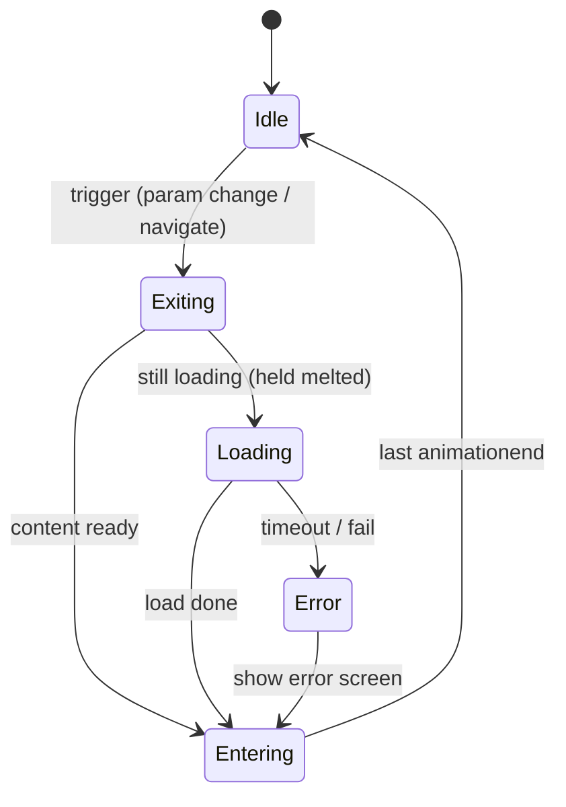
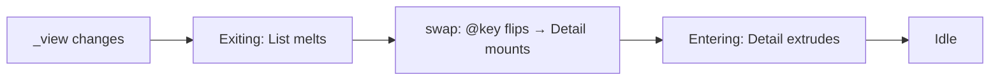
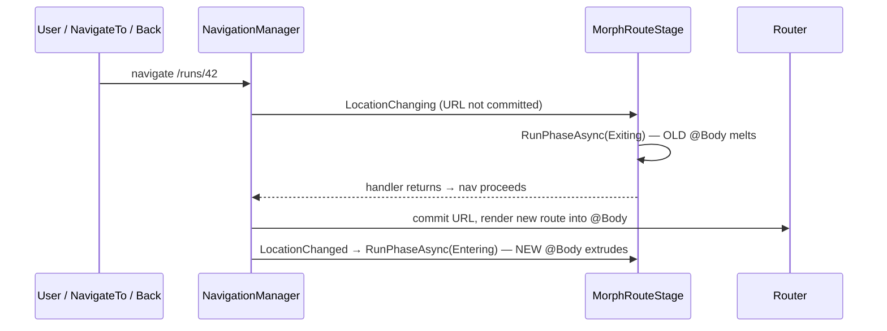

# Animation / Routing / UI Foundation — Implementation Plan

> **Revision 2** (2026-06-09) — reworked after a code-quality review of Rev 1's
> snippets. The behaviour/phase-model is unchanged; the *wiring* got much
> smaller. Net deletions vs Rev 1: the hand-rolled render barrier, the
> `Task.Delay` duration math, the `maxDepth` back-channel, the mutable
> `MorphContext`, the `static` transition registry, and the two divergent
> integration models. Nothing here is built yet (`src/Morph/` does not exist).

> **What this is.** A phased plan for a **reusable foundation library** ("Morph")
> providing the animation engine, the screen-transition/routing integration, and
> the base **shape** component every screen is built from. **Domain-agnostic** —
> no DTOs, no flow/run specifics. `RemoteAgents.Web` is the *first consumer* and
> must drop onto it cleanly; nothing here is specific to it.
>
> **Grounding.** Every mechanism was de-risked on 2026-06-09 — see
> [[transition-engine-validation]], `research/transition-*`, and the
> `spikes/probe-depth` / `spikes/probe-router` / `spikes/maui-shell` spikes. The
> effect works in **pure CSS + C# with zero JS interop** across web, Windows-
> native, and Android-native shells.

---

## 1. Identity & scope

**Morph** = a theme-agnostic Blazor WASM Razor Class Library offering:

1. **One shape** — `MorphShape`, a container that *owns its transition*. Callers
   pour content in; they never write animation.
2. **Depth-layered staggering** — nested shapes animate in bands by nesting depth.
3. **A DI-registered transition set** — animation *types* are data the **consumer**
   can extend without touching the library.
4. **One phase engine** — `exit → (await load) → enter`, driven by the browser's
   own `animationend` signal.
5. **Two triggers on that one engine** — a declarative param-watch (in-page) and a
   router adapter (`LocationChanging`) for real, deep-linkable routes.

**Out of scope:** any domain model, concrete screen, or DTO. The neumorphic look
is *one theme* (a CSS file), swappable without touching the motion core.

**YAGNI guardrails.** No speculative abstraction. The single planned seam (the
motion backend) is justified by a *named* open decision (pure-CSS vs JS engine)
and is introduced only on the second driver — until then the motion step is
*isolated*, not interfaced.

---

## 2. Vocabulary

| Term | Meaning |
|------|---------|
| **Shape** | The one container component `MorphShape`. Knows its **depth** (via a cascading `MorphStageContext` — depth + `Child()` + `Report()`; see D-C). Writes `--depth` inline. Themed by a CSS class. |
| **Depth / Layer** | Nesting depth → animation band. `--depth` is written **inline at render time** (validated: this is what prevents the layer-0 flash). |
| **Stage** | A region that runs the phase engine. `MorphStage<TKey>` (declarative, in-page) or `MorphRouteStage` (wraps `@Body`). Both inherit `MorphStageBase`. |
| **Phase engine** | `MorphStageBase`: sets `data-phase`, renders, and `await`s the last `animationend` (with a safety ceiling). The whole orchestrator. |
| **TransitionDefinition** | A record describing one animation *type* (exit/enter keyframe names + timing). Registered in `MorphOptions`, selected by name. |
| **MorphOptions** | DI singleton: the registered transition set + global knobs (default, ceiling, load-timeout, reduced-motion). |

---

## 3. Project layout

A **Razor Class Library** `src/Morph/` (ships components *and* bundled CSS),
referenced by `RemoteAgents.Web`. An assembly boundary is justified — it *earns
reuse* (the repo's assembly rule). Consumers load its CSS from
`_content/Morph/morph.css` + `_content/Morph/neu.css`.

```
src/Morph/
  MorphStageBase.cs        // the phase engine (animationend-driven). No UI markup.
  MorphStage.razor         // @typeparam TKey — declarative in-page trigger
  MorphRouteStage.razor    // wraps @Body — LocationChanging/LocationChanged trigger
  MorphShape.razor         // the one shape: --depth inline + themed by Class
  TransitionDefinition.cs  // a record: one animation type as data
  MorphOptions.cs          // the registered set + knobs
  ServiceCollectionExtensions.cs  // AddMorph(...)
  Phase.cs                 // enum + ToDataPhase()
  _Imports.razor           // @namespace Morph
  wwwroot/
    morph.css              // motion: keyframes + stage rules (theme-agnostic)
    neu.css                // theme: tokens + .neu-raised/.neu-inset primitives
```

`morph.css` is the engine; `neu.css` is a skin. A different look = a different
theme file; the motion core is untouched.

---

## 4. Control knobs

| Knob | Where | Default | Effect |
|------|-------|---------|--------|
| `Transition` (type name) | per-`MorphStage` (or per-`MorphShape`) | `"morph"` | which registered `TransitionDefinition` drives exit/enter |
| `Ceiling` | `MorphOptions` | 1200 ms | safety net if an `animationend` is missed; **also** the cap on a phase |
| `LoadTimeout` | `MorphOptions` | 10 s | async-gate budget → error path on expiry |
| `ReducedMotion` | `MorphOptions` | auto | CSS sets `animation:none`; engine skips the `await` entirely |
| Layer interval / durations / ease | per `TransitionDefinition` | — | ripple speed + phase feel; set as CSS vars **on the stage** |
| per-shape extra animation | inline on a `MorphShape` | none | a component layers its own animation on *disjoint properties* |

> **Var-ownership rule (cohesion).** The **stage** owns the type + timing vars
> (`data-phase` + the definition's vars). The **shape** owns only `--depth`.

---

## 5. Extension points

| To add… | The **consumer** does | Touches library code? |
|---------|------------------------|------------------------|
| **A new animation type** | `services.AddMorph(o => o.Add(new TransitionDefinition(...)))` + one keyframe pair in their CSS | **No** |
| **A new shape variant** | `<MorphShape Class="my-style">` | No |
| **A new theme** | a CSS token/primitive file; motion core unchanged | No |
| **A new async source** | pass any `Func<Task>` to the stage | No |
| **A JS motion backend** (GSAP/Motion) | introduce `IMotionDriver`, implement a JS driver; default stays CSS | Only on the *second* driver (YAGNI) |

---

## 6. Key types (illustrative sketches — not final code)

### 6.1 `MorphShape` — the one shape; hides animation, owns only `--depth`

```razor
@namespace Morph
<div class="morph-item @Class" style="--depth:@Depth">
    @* children are one layer deeper — the ripple falls out of the tree *@
    <CascadingValue Name="MorphDepth" Value="Depth + 1">@ChildContent</CascadingValue>
</div>

@code {
    [CascadingParameter(Name = "MorphDepth")] int Depth { get; set; }   // parent's depth; root stage provides 0
    [Parameter] public string? Class { get; set; }                      // theme hook: "neu-raised", "neu-inset", …
    [Parameter] public RenderFragment? ChildContent { get; set; }
}
```

> **As-built note (supersedes this sketch):** depth is carried by a minimal
> `MorphStageContext` (depth + `Child()` + `Report()`), not a bare int — see D-C.
> It has no sibling counter (the bug Rev 1 had); `Child()` is structural `+1`, and
> `Report()` feeds only the stage's `--max-depth` for innermost-first exit
> (presentation, not timing). `--depth` is still inline so it's correct on first
> paint (the no-flash requirement). `<MorphShape Class="neu-raised">` is the card;
> `Class="neu-inset"` is the well — one component, not three wrappers.

### 6.2 `TransitionDefinition` + DI registration — types are data the consumer owns

```csharp
public sealed record TransitionDefinition(
    string Name, string ExitKeyframes, string EnterKeyframes,
    int ExitMs, int EnterMs, int LayerInterval, string Ease)
{
    public string Vars =>            // set on the STAGE (var-ownership rule)
        $"--anim-exit:{ExitKeyframes};--anim-enter:{EnterKeyframes};" +
        $"--exit-dur:{ExitMs}ms;--enter-dur:{EnterMs}ms;" +
        $"--layer-interval:{LayerInterval}ms;--ease:{Ease};";
}

public sealed class MorphOptions
{
    public string  Default     { get; set; } = "morph";
    public int     Ceiling     { get; set; } = 1200;
    public int     LoadTimeout { get; set; } = 10_000;
    public bool    ReducedMotion { get; set; }
    private readonly Dictionary<string, TransitionDefinition> _defs = new();
    public MorphOptions Add(TransitionDefinition d) { _defs[d.Name] = d; return this; }
    public TransitionDefinition Resolve(string? name) => _defs[name ?? Default];
}

public static class ServiceCollectionExtensions
{
    public static IServiceCollection AddMorph(this IServiceCollection s, Action<MorphOptions>? cfg = null)
    {
        var o = new MorphOptions().Add(BuiltInTransitions.Morph);   // ships one default
        cfg?.Invoke(o);
        return s.AddSingleton(o);
    }
}
```

> Adding `slide` is a *consumer* call — `AddMorph(o => o.Add(slideDef))` + one
> keyframe pair — with **zero edits to the library**. That is the actual
> "configurable/extensible" the static class in Rev 1 only claimed.

### 6.3 `MorphStageBase` — the entire phase engine (no render barrier, no delay math)

```csharp
public abstract class MorphStageBase : ComponentBase
{
    [Inject] protected MorphOptions Options { get; set; } = default!;

    protected Phase Phase { get; private set; } = Phase.Idle;
    protected bool  Loading { get; private set; }
    private TaskCompletionSource? _animDone;

    // data-phase: Loading reuses "exit" so items STAY melted (changing it would
    // drop the exit animation and snap them visible — a flash).
    protected string DataPhase => Phase switch {
        Phase.Exiting or Phase.Loading => "exit",
        Phase.Entering                  => "enter",
        _                               => "" };

    protected void OnAnimationEnd(AnimationEventArgs _) => _animDone?.TrySetResult();   // last item wins (debounced)

    protected async Task RunPhaseAsync(Phase phase)
    {
        Phase = phase;
        _animDone = new(TaskCreationOptions.RunContinuationsAsynchronously);
        StateHasChanged();                                  // render → CSS class live → browser animates
        if (!Options.ReducedMotion)
            await Task.WhenAny(_animDone.Task, Task.Delay(Options.Ceiling));   // DOM signal + safety net
    }

    // Composed flow for the IN-PAGE trigger (load is optional, no DTO knowledge):
    protected async Task TransitionAsync(Func<Task>? load, Action swap)
    {
        var loading = load?.Invoke() ?? Task.CompletedTask;     // start load DURING the melt
        await RunPhaseAsync(Phase.Exiting);                     // exit animation IS the min-floor
        if (!loading.IsCompleted)
        {
            Phase = Phase.Exiting; Loading = true; StateHasChanged();   // hold melted + show loader
            await WithTimeout(loading, Options.LoadTimeout);            // → error path on expiry
            Loading = false;
        }
        swap();                                                  // mutate the screen identity
        await RunPhaseAsync(Phase.Entering);
        Phase = Phase.Idle; StateHasChanged();
    }
}
```

> Compare to Rev 1's controller + event + `TaskCompletionSource` render barrier +
> `Task.Delay(ExitMs + maxDepth*interval)`: same behaviour, none of the fragile
> pieces. The `animationend` signal removes the render barrier, the duration math,
> the `maxDepth` back-channel, and the explicit min-floor at once.

### 6.4 `MorphStage<TKey>` — the declarative in-page trigger

```razor
@namespace Morph
@typeparam TKey
@inherits MorphStageBase

<div class="morph-stage" data-phase="@DataPhase" style="@Options.Resolve(Transition).Vars"
     @onanimationend="OnAnimationEnd">
    <CascadingValue Name="MorphDepth" Value="0">
        <div @key="_current">@ChildContent(_current)</div>   @* @key forces remount → enter replays *@
    </CascadingValue>
</div>
@if (Loading) { <div class="morph-loader">@LoadingContent</div> }

@code {
    [Parameter, EditorRequired] public TKey Screen { get; set; } = default!;
    [Parameter, EditorRequired] public RenderFragment<TKey> ChildContent { get; set; } = default!;
    [Parameter] public string? Transition { get; set; }
    [Parameter] public Func<TKey, Task>? Load { get; set; }
    [Parameter] public RenderFragment? LoadingContent { get; set; }

    TKey _current = default!;

    protected override async Task OnParametersSetAsync()
    {
        if (EqualityComparer<TKey>.Default.Equals(Screen, _current)) return;   // same screen → no-op
        var target = Screen;
        await TransitionAsync(
            load: Load is null ? null : () => Load(target),
            swap: () => _current = target);
    }
}
```

> `@key="_current"` is load-bearing: without it, swapping between two records of
> the *same* screen type diffs in place and the enter animation never plays.

### 6.5 `MorphRouteStage` — the router trigger (same engine, split across nav events)

```razor
@namespace Morph
@inherits MorphStageBase
@implements IDisposable

<div class="morph-stage" data-phase="@DataPhase" style="@Options.Resolve(Transition).Vars"
     @onanimationend="OnAnimationEnd">
    <CascadingValue Name="MorphDepth" Value="0">@Body</CascadingValue>
</div>

@code {
    [Inject] NavigationManager Nav { get; set; } = default!;
    [Parameter, EditorRequired] public RenderFragment? Body { get; set; }
    [Parameter] public string? Transition { get; set; }
    IDisposable? _reg;

    protected override void OnInitialized()
    {
        _reg = Nav.RegisterLocationChangingHandler(async ctx =>
        {
            if (Phase != Phase.Idle) return;                       // re-entrancy guard (validated)
            if (UrlsEqual(ctx.TargetLocation, Nav.Uri)) return;    // same-URL no-op (validated)
            await RunPhaseAsync(Phase.Exiting);                    // melt OLD @Body before the URL commits
        });
        Nav.LocationChanged += OnChanged;
    }

    async void OnChanged(object? _, LocationChangedEventArgs __)    // new @Body mounted → extrude
    {
        await RunPhaseAsync(Phase.Entering);
        Phase = Phase.Idle; StateHasChanged();
    }

    public void Dispose() { _reg?.Dispose(); Nav.LocationChanged -= OnChanged; }
}
```

> Validated by `spikes/probe-router`, incl. browser back/forward. The router does
> the content swap (replaces `@Body`); the stage only runs the two phases. Same
> `RunPhaseAsync` as the in-page case — **one engine, two triggers.**

---

## 7. CSS convention

```css
/* morph.css — the stage reads the chosen type from inline vars; it NEVER names a type */
.morph-stage[data-phase="exit"]  .morph-item {
    animation: var(--anim-exit)  var(--exit-dur)  var(--ease) forwards;   /* forwards: stays melted during Loading */
    animation-delay: calc(var(--depth, 0) * var(--layer-interval));
}
.morph-stage[data-phase="enter"] .morph-item {
    animation: var(--anim-enter) var(--enter-dur) var(--ease) backwards;  /* backwards: no first-frame flash */
    animation-delay: calc(var(--depth, 0) * var(--layer-interval));
}

/* A new TYPE is a self-contained keyframe pair — adding it touches nothing else. */
@keyframes morph-exit  { to { box-shadow: 0 0 0 transparent, 0 0 0 transparent; opacity:0; transform:scale(.95) } }
@keyframes morph-enter { from { opacity:0; transform:scale(.93) } }

@media (prefers-reduced-motion: reduce) { .morph-stage .morph-item { animation: none } }
```

**Disjoint-property contract (the one real risk).** Base keyframes own
`transform / opacity / box-shadow`. A per-component extra animation must animate
*other* properties (`filter`, `color`, …). Same-property collisions resolve
silently by last-declared-wins — so this is documented and ideally lint-checked.

**Completion detection.** `@onanimationend` bubbles every item's event to the
stage; the phase resolves when the last-delayed one fires (debounced), with
`Ceiling` as the backstop. This is the small cost of dropping `Task.Delay`-by-
duration — honest trade, but it deletes the render barrier and the depth
back-channel, which is the better deal (see §9 D-E).

---

## 8. Phased build plan (walking-skeleton; one commit + verify per phase)

| Phase | Deliverable | Done-when |
|-------|-------------|-----------|
| **0 — Skeleton** | RCL `src/Morph/` + `AddMorph(...)` DI + `neu.css`/`morph.css`; `RemoteAgents.Web` references it and loads `_content/Morph/*.css`. | Web app renders a `.neu-raised` element. Warning-free. |
| **1 — Shape + depth** | `MorphShape` with the cascading `--depth` int. No motion yet. | Nested `MorphShape`s emit correct inline `--depth` (verified in DOM). |
| **2 — Phase engine + in-page stage** | `MorphStageBase` (animationend), `MorphStage<TKey>` with `@key`, the built-in `morph` transition. | In-page swap melts/extrudes by depth; **Playwright contact-sheet shows no flash**; same-type swap (changed `@key`) replays enter. |
| **3 — Router trigger** | `MorphRouteStage` across ≥2 real routes; re-entrancy + same-URL guards; reduced-motion zeroes the await. | Link / programmatic / back / forward all animate (re-confirm the probe in the lib). |
| **4 — Transition registry** | Prove consumer extensibility: register `slide` via `AddMorph` + a keyframe pair; per-shape override; disjoint-property contract. | Toggling type swaps the animation with **no library edit and no new branch**. |
| **5 — Async gate** | The `Loading` overlay: load concurrent with exit, held-melted rest, timeout/error path, `LoadingContent`. | Fast load looks unchanged; slow load rests melted then enters; failed load enters an error state. |
| **6 — Adoption seam** | One real `RemoteAgents.Web` page renders through Morph against the live Host. **No DTO work.** | e.g. `/runs` renders its content inside `MorphShape`s end-to-end. |

Verification uses the Playwright capture/record harness (the in-tool preview is
blind to these animations — hidden document). Each phase: warning-free build,
green tests where applicable, motion verified by contact sheet, one commit.

---

## 9. Blazor-library hygiene (apply throughout)

- Consumers reference `_content/Morph/morph.css` + `neu.css` — document it (or
  auto-inject via the RCL's `index.html` guidance).
- `[EditorRequired]` on `Screen` / `ChildContent` / `Body`.
- Components `sealed`; `MorphStageBase` `abstract`.
- `IDisposable` to unhook the `LocationChanging` registration **and** the
  `LocationChanged` handler.
- `@namespace Morph` + a library `_Imports.razor`.
- Mid-animation `StateHasChanged` is safe for **CSS** animations (they don't
  restart unless the class/keyframe changes), so no `ShouldRender` gymnastics —
  but the swap path must change `@key`, not mutate in place.

---

## 10. Open decisions (carry into the build, don't pre-bake)

- **D-A. Motion backend.** Default = pure CSS (validated). Keep the motion step
  *isolated*; introduce `IMotionDriver` only when a JS engine earns its place.
- **D-B. Reduced-motion detection.** `ReducedMotion` needs one `matchMedia` read
  (the single unavoidable interop) or a pure config flag. With `animationend`,
  reduced-motion simply skips the `await`. Decide at Phase 3.
- **D-C. Exit order. RESOLVED → innermost-first melt** (contents collapse, then
  the shell sinks; enter stays outermost-first). This needs the stage's max
  depth, so the as-built code reintroduces a minimal `MorphStageContext` (depth +
  `Child()` + `Report()`) — the *justified second use* of depth now that both
  per-item `--depth` and the stage's `--max-depth` consume it. It drives
  presentation only; phase timing stays `animationend`-driven, and reporting
  happens at mount (idle), never mid-animation. Nested stages stay correct via
  CSS nearest-ancestor `--max-depth` inheritance. Validated in `spikes/morph-demo`
  (in-page + routing, incl. the nested inner-stage page). Exit CSS:
  `animation-delay: calc((var(--max-depth) - var(--depth)) * var(--layer-interval))`.
- **D-D. Theme packaging.** `neu.css` ships inside Morph; split into a separate
  theme package only on the second theme.
- **D-E. Completion detection.** `animationend` debounce vs known-count vs a
  single max-delay sentinel item; `Ceiling` is the backstop regardless. Settle
  the exact mechanism in Phase 2 against the Playwright harness.

---

## 11. How it works — use cases & flows

### 11.1 Why a phase engine exists

A screen swap is **not atomic**: the old content must animate *out* before it's
removed, the new content must *exist* before it animates *in*, and an async load
must not show a blank screen. Blazor diffs-and-replaces instantly, so something
must **sequence across time**: exit → swap → enter. That is `MorphStageBase`.



### 11.2 Basic in-page swap — "unload this, load that"

`MorphStage` watches `Screen`; when it changes, the engine runs exit → swap →
enter. The caller writes **no animation code**:

```razor
<MorphStage Screen="_view" Context="v">
    @if (v == View.List) { <RunList OnOpen="@(r => _view = View.Detail)" /> }
    else                  { <RunDetail OnBack="@(() => _view = View.List)" /> }
</MorphStage>
@code { View _view = View.List; }
```



### 11.3 Async-gated — "do something, load, wait, then continue"

Pass `Load`. It runs **during** the melt, so a fast load adds zero visible wait; a
slow load holds the melted state + a loader until ready.

```razor
<MorphStage Screen="_runId" Load="LoadRun" Context="id">
    <RunDetail Run="_run" />
    <LoadingContent><div class="spinner"/></LoadingContent>
</MorphStage>
@code { async Task LoadRun(Guid id) => _run = await Api.GetRunAsync(id); }
```

```
Fast (load < exit):  exit |----melt----| swap |--extrude--|     ← identical to no-load
                     load |--fetch--|(waits for melt to finish)
Slow (load > exit):  exit |----melt----|··held melted + loader··| swap |--extrude--|
                     load |---------------fetch---------------|
```

### 11.4 Adding a new animation type (consumer-side, no library edit)

```csharp
// in the consumer's Program.cs
services.AddMorph(o => o.Add(new TransitionDefinition(
    "slide", "slide-exit", "slide-enter", 300, 340, 90, "cubic-bezier(0.4,0,0.2,1)")));
```
```css
/* in the consumer's CSS */
@keyframes slide-exit  { to   { transform: translateX(-40px); opacity: 0 } }
@keyframes slide-enter { from { transform: translateX(40px);  opacity: 0 } }
```
```razor
<MorphStage Screen="_view" Transition="slide" Context="v"> … </MorphStage>
```

### 11.5 Routing — "go to this screen" and the system transitions itself

`MorphRouteStage` wraps `@Body` in the layout; you navigate the normal Blazor way
and the transition happens. Exit runs *before* the URL commits; enter runs after
the new route mounts.

```razor
@* MainLayout.razor *@
<MorphRouteStage Body="@Body" />
```


### 11.6 One engine, two triggers

In-page swaps drive the engine from a **parameter change**; routes drive it from
**nav events**. Both call the same `RunPhaseAsync` on `MorphStageBase`. The only
difference is *what* swaps — a `@key`'d fragment vs the router replacing `@Body`.
