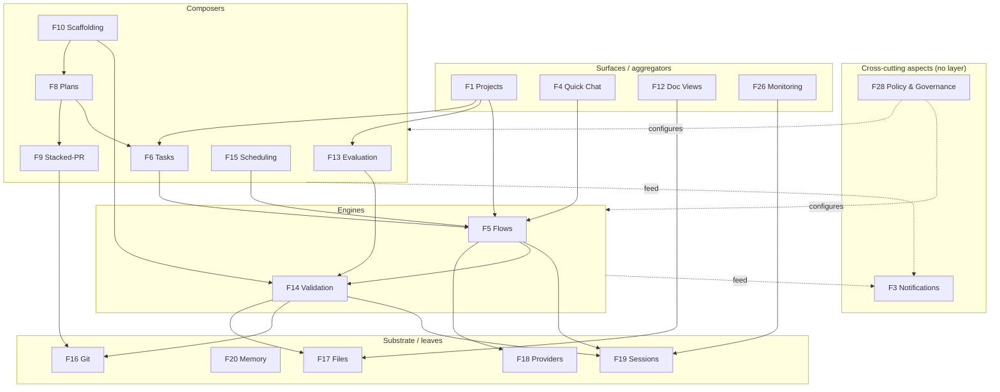

# Capability Spec — Feature Map & Dependencies

> **Purpose.** A living, napkin-level map of the product's *capabilities* (the
> things built around the flow engine, not on top of it) and how they depend on
> each other. The goal at this stage is **dependency mapping**, not technical
> design — so each capability gets quick prose (**What · Why · How**) plus its
> two dependency lines (**Uses · Used by**). The "Uses/Used by" lines *are* the
> dependency graph.
>
> **How to use.** We grow it by iteration: talk a capability through, record the
> blurb, move to the next. Once enough are filled, the Uses/Used-by edges give us
> the structure to organize the project around. Sibling: the front-end IA lives
> in [`product-ui-spec.md`](product-ui-spec.md); this is the capability/back-end
> side.

---

## 1. Quality vocabulary (Validation · Evaluation · Review)

Settled distinction, grounded in the established literature (V&V — IEEE 1012 /
ISO-IEC-IEEE 12207; code-review — Fagan inspections, Bacchelli & Bird ICSE'13;
evals — LLM-as-a-judge / MT-Bench, measurement-theory rubrics). Two layers, one
atom:

- **Validation — the atom.** Input → findings → **verdict rule** (severity /
  threshold) → **pass/fail + a list of issues/feedback**. One shape, many
  implementations spanning deterministic (linter, arch-test, build, tests) to
  judgment (reviewer/judge agent). It *reports*; it does **not** decide
  consequences — a gate (the consumer) decides whether a fail blocks.
- **Reviewer / Linter — not features.** They are *implementation flavors* of a
  validation: a reviewer is an agent-backed validation, a linter is a
  deterministic one. Same verdict shape.
- **Evaluation — the aggregate.** A *collection* of validations → a **grade**,
  plus history, thresholds, and degradation alerts. Grading mixes
  **non-compensatory must-pass gates** (a critical fail can't be averaged away)
  with a **weighted score** for the rest — not a naive 2-of-3 count.
- **Verdict rule.** The severity/threshold step that turns findings into
  pass/fail. Trivial for a linter (errors > 0 → fail); a real decision for a
  reviewer. A scored judge's number rides along in the findings — Validation's
  *verdict* stays binary, but the raw score is preserved for Evaluation to use.

> **Naming note.** What we call **"Validation"** is, in the formal SE V&V
> standard, closer to **"verification"** ("are we building it right?" —
> conformance checks). The standard reserves "validation" for fitness-for-use.
> We keep the name "Validation" deliberately; flagged so the clash is on record.

---

## 2. Capability inventory (the 19)

Stable IDs (lowest original number per merge). *(given)* = already built.

| ID | Capability | One-liner |
|----|-----------|-----------|
| F1 | Projects | List projects; per-project command-center |
| F3 | Notifications / Inbox | Typed queue of things needing-you |
| F4 | Quick Chat | Zero-setup chat; rides flow-engine |
| F5 | Flows *(given)* | Launch and watch orchestration runs |
| F6 | Tasks | Per-project board; templated task instances |
| F8 | Plans | Memory-based phased plans, PR-per-phase |
| F9 | Stacked-PR Review | Review phased PR stack, approve/deny |
| F10 | Guided Scaffolding | Guided scaffolding; project or feature |
| F12 | Structured Document Views | Domain views over ADRs, specs |
| F13 | Evaluation | Scored, tracked checks; threshold alerts |
| F14 | Validation | Run checks, produce verdicts/findings |
| F15 | Scheduling | Run anything on a recurring schedule |
| F16 | Git *(given)* | Git status and operations |
| F17 | Filesystem | Search, read, write files |
| F18 | Providers | Account auth plus model selection |
| F19 | Sessions & Artifacts | Per-run workspaces; watch or take-control |
| F20 | Memory | Durable store plans/agents use |
| F26 | Monitoring | Cost, usage, and process-health |
| F28 | Policy & Governance | Guardrails, signoff, judges, budgets |

Cross-cutting **concept** (not a feature): **Templating** — recurs in Tasks,
Plans, Scaffolding, Flows; whatever owns templates is substrate, the rest are
consumers.

Infra: F21 Host · F22 Clients · F23 Tailscale. Future: F24 Node-builder ·
F25 Dynamic-agents.

---

## 3. Per-capability blurbs

### F14 · Validation

- **What** — Runs a check against a target (diff, files, artifact) and returns a
  verdict: **pass/fail + a list of issues/findings**. One atom, many
  implementations — deterministic (linter, arch-test, build, unit/acceptance)
  through judgment (reviewer/judge agent).
- **Why** — The shared "is this OK?" primitive. Everything quality-related needs
  verdicts; one capability means everything checks the same way and emits the
  same shape.
- **How** — Named checks/suites pointed at a target, invoked as a flow step, an
  agent fix-loop (check → fix → re-check), or a standalone run. Findings pass
  through a **verdict rule** (severity / threshold) → pass/fail; a scored judge's
  number rides along in the findings for Evaluation to use. Validation
  **reports** — the consumer (a gate) decides if a fail blocks.
- **Uses** — Agents/Models (for judges/reviewers), Filesystem, Git, Sessions.
- **Used by** — Flows, Evaluation, Notifications, Build-loop (Plans/PR-stack),
  Guided Scaffolding.

### F13 · Evaluation

- **What** — A named collection of validations run against a target → a **grade**, with history and thresholds.
- **Why** — Turns one-shot verdicts into a *tracked quality signal* you can watch degrade and alert on.
- **How** — Bundle validations; grade = must-pass gates (critical) + weighted score (rest); persist each run for history; threshold breach → notify → optionally kick a remediation flow.
- **Uses** — Validation, Memory (history), Scheduling (recurring runs).
- **Used by** — Notifications, Monitoring, Projects, Build-loop (as a gate).

## Shell

### F1 · Projects

- **What** — Holds the set of projects; each gets a command-center hub aggregating its artifacts, runs, agents, files, git, KPIs.
- **Why** — Top-level container; nearly everything is scoped to a project.
- **How** — Register/list projects; pick one to scope into; the hub aggregates the other capabilities filtered to that project.
- **Uses** — Filesystem, Git, Flows, Tasks, Evaluation, Notifications, Monitoring.
- **Used by** — provides scoping context to most capabilities; entry point for Clients.

### F3 · Notifications / Inbox

- **What** — Cross-project + per-project queue of typed items needing the human: PR awaiting review, task needs approval, agent needs feedback, evaluator degraded.
- **Why** — Makes multi-project / multi-flow operation viable — one place for everything blocked on you.
- **How** — Capabilities emit typed items; inbox aggregates, filters by project, routes you to the thing; clearing an item resolves the underlying block.
- **Uses** — (consumes events from) Validation, Evaluation, Build-loop, Flows, Tasks.
- **Used by** — Projects (badge/strip), Clients. Mostly a sink.

### F4 · Quick Chat

- **What** — Zero-setup, pick-a-model chat/terminal session with an agent, like raw Claude Code.
- **Why** — A fast door to an agent with no flow-building; the everyday scratchpad.
- **How** — Pick model, start a session, converse; optionally file the result into a project later. Rides the flow engine (a trivial single-agent flow) with a conversational UX.
- **Uses** — Flows (engine), Providers, Sessions, Filesystem, Git.
- **Used by** — Projects (launch point), Clients.

## Orchestration

### F5 · Flows *(given)*

- **What** — Launch orchestration runs from templates with a prompt + config; watch live (status, feedback, terminal, artifacts); each run gets its own session.
- **Why** — The core orchestration capability — the first hard piece; drives agents through multi-step recipes.
- **How** — Pick a flow template, configure, start; runs in background with live snapshots; interact via questions/permissions; produces artifacts.
- **Uses** — Sessions, Providers/Agents, Validation, Filesystem, Git, Memory.
- **Used by** — Quick Chat, Build-loop, Scheduling, Evaluation (remediation), Projects.

## Build loop

### F6 · Tasks

- **What** — Per-project board of work items (todo / awaiting-review / done), moved by humans and agents; each built to a structured template.
- **Why** — Shared human+agent work tracking; the unit a plan's phase maps to.
- **How** — Create/move tasks; templates make each buildable the same way; agents pick up and progress tasks, opening PRs; some transitions human-gated.
- **Uses** — Templating (concept), Memory, Flows, Git/PRs, Notifications.
- **Used by** — Plans (phase = task), Projects, Build-loop.

### F8 · Plans

- **What** — Structured, memory-based, phased plans; each phase = a task; executed one-by-one, PR-per-phase, plan updated with insights as it runs.
- **Why** — Makes multi-step builds as deterministic as possible; the spine of the build loop.
- **How** — Authored (often via Scaffolding); phases become tasks; agents execute phase-by-phase, opening a PR per phase and recording insights back into the plan.
- **Uses** — Memory, Tasks, Flows, Validation, Git, Stacked-PR Review.
- **Used by** — Build-loop, Guided Scaffolding (creates them), Projects.

### F9 · Stacked-PR Review

- **What** — Review a stack of phase PRs one-by-one from the start: approve→advance, deny→block downstream + rebuild that phase from feedback, reconcile, re-deliver.
- **Why** — Lets agents run ahead (assume-approved) while you review async; turns phased delivery into a reviewable stack.
- **How** — Phases emit a PR stack; you walk it; approvals cascade; a denial halts the chain, drops downstream from the inbox, triggers a rebuild from your feedback, reconciles, re-delivers.
- **Uses** — Git, Plans, Validation, Notifications, Flows (rebuild).
- **Used by** — Build-loop, Projects, Notifications.

## Authoring

### F10 · Guided Scaffolding

- **What** — A guided machine that walks you through authoring a structured sequence of files (agent-validated), then creates the folders/files. Content variant = project setup or feature kickoff.
- **Why** — Turns intent into the strict structured docs/structure the rest of the system operates on.
- **How** — Step-through; each step writes a specific doc validated by agents; on completion creates the structure (and often an initial Plan).
- **Uses** — Templating, Validation, Filesystem, Agents/Flows, Memory.
- **Used by** — Projects (setup), Plans (creates), Structured Document Views.

### F12 · Structured Document Views

- **What** — Domain-aware views over the filesystem (ADRs, specs, plans) — read/present in simpler models instead of raw folders.
- **Why** — Structured docs are central; browsing raw folders is too low-level.
- **How** — Read known doc types from the repo, render them in purpose-built views (ADR ledger, spec viewer, plan/phase view).
- **Uses** — Filesystem, Git, Memory (plans).
- **Used by** — Projects, Guided Scaffolding (its output), Build-loop.

## Triggers

### F15 · Scheduling

- **What** — Trigger any flow / eval / agent on a recurring schedule (cron + events).
- **Why** — Recurring quality runs, routines, the self-improvement loop — without manual kicks.
- **How** — Define a schedule pointing at a flow/eval/agent + config; fires on cadence/event; results flow into the normal surfaces + notifications.
- **Uses** — Flows, Evaluation, Agents.
- **Used by** — Evaluation (recurring runs), Build-loop (self-improvement), Projects.

## Substrate

### F16 · Git *(given)*

- **What** — Git status + operations (diff, branches, commit, push) with guardrails.
- **Why** — Code lands in git; PRs/diffs/reviews ride on it.
- **How** — Facade over git ops with guardrails (no `-A`, no force-push to main, co-author trailer).
- **Uses** — Filesystem, Sessions/Shell.
- **Used by** — Flows, Validation, Stacked-PR Review, Plans, Tasks, Doc Views, Monitoring.

### F17 · Filesystem

- **What** — Search, read, write files in a project workspace.
- **Why** — The lowest substrate — everything touching code/docs goes through it.
- **How** — Scoped file access per project/session.
- **Uses** — (leaf; Sessions for workspace scope).
- **Used by** — nearly everything (Validation, Flows, Doc Views, Scaffolding, Git, Quick Chat).

### F18 · Providers

- **What** — Manage provider accounts (auth, subscription, usage caps, key-scrub) and select models per run.
- **Why** — Agents need a model + a subscription-safe path; the real onboarding step.
- **How** — Connect/auth accounts; expose available models; pick a model when launching a chat/flow; enforce subscription safety.
- **Uses** — (leaf-ish; external CLIs/accounts).
- **Used by** — Quick Chat, Flows, Validation (judges), Agents, Monitoring (cost).

### F19 · Sessions & Artifacts

- **What** — Per-run workspace + process (terminal/PTY) and the artifacts it produces; watchable live, with take-control.
- **Why** — The runtime substrate flows/chats/validation execute in; home of the live terminal + artifacts.
- **How** — Spin a session (workspace + process) per run; stream output; collect artifacts; allow take-control of the keyboard; anti-zombie teardown.
- **Uses** — Filesystem, Shell/PTY, Host.
- **Used by** — Flows, Quick Chat, Validation, Monitoring (health).

### F20 · Memory

- **What** — Durable store the memory-based plans (and agents) ride on.
- **Why** — Plans/insights must survive context resets; deterministic resume needs persisted state.
- **How** — Persist plan phases, insights, task state, agent memory; reload into fresh contexts per phase.
- **Uses** — Filesystem (storage).
- **Used by** — Plans, Tasks, Agents, Doc Views.

## Govern / observe

### F26 · Monitoring

- **What** — Cost & usage (tokens/time/$) + process health (CLIs alive, sessions, anti-zombie).
- **Why** — Subscription billing + rate limits + long-running processes need observability.
- **How** — Meter runs/agents/models for cost; watch sessions/processes for health; surface in dashboards + notifications.
- **Uses** — Sessions, Providers, Flows.
- **Used by** — Projects, Notifications, Policy & Governance (budgets).

### F28 · Policy & Governance

- **What** — Configure the rules: per-agent guardrails (Ask/Auto/Bypass), signoff profiles, judge pairing, budgets, write-boundaries/roles.
- **Why** — One place to govern how agents may act and how gates/quality are enforced.
- **How** — Per-project config surfaces; agents/flows/validation/eval/build-loop read it at runtime; profiles (solo/team/high-stakes) bundle defaults.
- **Uses** — Memory/Filesystem (config), Providers.
- **Used by** — Flows, Validation, Evaluation, Stacked-PR Review (gates), Agents, Monitoring (budgets).

---

## 4. Dependency map read as structure

Reading the `Uses / Used-by` lines across all 19, a clean stratification falls
out. Arrows point **downward** = "depends on / uses". Edges shown are
representative — the authoritative edge list is the per-capability lines above.

**The five bands:**

| Band | Capabilities | Trait |
|------|-------------|-------|
| Substrate / leaves | Files, Memory, Git, Sessions, Providers | Used by many, use little. Most stable. |
| Engines | **Flows, Validation** | Two peers. Heavily reused. |
| Composers | Evaluation, Tasks, Plans, Stacked-PR, Scaffolding, Scheduling | Assemble engines + substrate. |
| Surfaces | Projects, Quick Chat, Doc Views, Monitoring | Aggregate / present. Used by nothing below. |
| Aspects | Policy & Governance, Notifications | Cut across all bands; not in a layer. |

## 5. What it implies for how we build

- **The base worth investing in is substrate + the two engines — not "Flows".**
  Flows turned out to be a mid-layer engine *peer to Validation*, both sitting on
  the substrate. The compounding investment is the leaves (Files/Sessions/Git/
  Providers/Memory) + Flows + Validation. That's the real "kernel" — **derived
  from the map, not declared up front.**
- **Dependency direction = downward only.** A band may use anything below it,
  never above. No leaf imports a Surface; no engine imports a composer. The two
  **aspects are the only cross-cuts**, and even they stay acyclic: Governance is
  *read-only config* pulled at runtime; Notifications is a *write-only event sink*
  pushed to. Neither creates an upward edge.
- **Build bottom-up, not by feature excitement.** Harden substrate + engines
  first; composers next; the **build-loop knot (Tasks/Plans/Stacked-PR) last** —
  it reaches almost everything, so it can't stabilize until its dependencies do.
- **The two aspects are infrastructure, not features.** Policy & Governance wants
  to be a **config service** every band reads; Notifications wants to be an
  **event/inbox bus** every band publishes to. Building either as a screen bolted
  onto one capability would be the wrong shape.
- **Projects is the shell/aggregator root** — it uses everything and is used by
  nothing beneath it. It's the scoping/composition context, and must never be
  depended on by a lower band.
- **The build loop is one tightly-coupled cluster.** Tasks/Plans/Stacked-PR share
  so many edges they likely develop as a single module even though they're
  distinct features.
