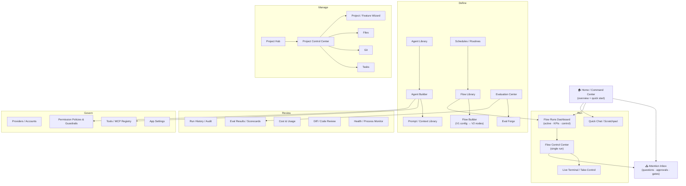
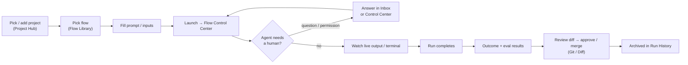

# Product UI — Feature Map & Information Architecture

> **Purpose.** Living spec for the *final-state* product UI: every screen, how
> they organize, and the open questions we're still resolving. This is the
> source we iterate on before writing prompts for **Claude Design**. It is a
> product/IA doc, **not** an implementation plan — the technical front-end
> plumbing (MAUI/Blazor/Tailscale/Host) lives in
> [`csharp-orchestrator-ui.md`](csharp-orchestrator-ui.md).
>
> **How to use this doc.** We grow it by iteration: Claude grills the owner on
> the open questions, decisions get recorded inline, and per-screen specs get
> fleshed out until each is detailed enough to paste into the UI platform.
> Nothing here is locked.

---

## 1. Summary

The product is a front-end for a .NET 10 Unity-agent orchestrator that drives
`claude`/`codex` CLIs over ConPTY. The UI must let a (currently single) user:

- **Define** reusable building blocks — agents, flows, evaluators, schedules.
- **Run** them and watch live — across many concurrent flows, not just one.
- **Stay in the loop** — answer agent questions and approve permission gates
  from a single place, even when several flows are blocked at once.
- **Review** what happened — run history, eval results, cost, diffs.
- **Manage** the things work happens *on* — projects, files, git, tasks.
- **Govern** the rules + plumbing — providers/accounts, permission policies,
  tools/MCP.

### Organizing spine — the lifecycle

Everything below maps to one of five lifecycle stages. This is the conceptual
backbone even though the sidebar is entity-first.

**Define → Run → Review → Manage → Govern**

| Stage | What it's for |
|-------|---------------|
| **Define** | Author the reusable things (agents, flows, evals, schedules) |
| **Run** | Launch + watch live (dashboard, control center, inbox, terminal) |
| **Review** | Look back (run history, eval results, diffs, cost) |
| **Manage** | The resources work happens on (projects, files, git, tasks) |
| **Govern** | The rules + plumbing (providers, permissions, tools, settings) |

---

## 2. Navigation map

### A representative user flow (run a flow, end to end)

---

## 3. Feature map (by area)

Legend: ⭐ = high-leverage / central · 🆕 = gap surfaced in brainstorm (not in
the owner's original list) · ❓ = has open question(s) below.

### 3.1 Home / cross-cutting

| Screen | Stage | Notes |
|--------|-------|-------|
| 🆕 **Home / Command Center** | Run | App-scoped glance: what's running now, recent activity, quick-start. Sits *above* the flow-scoped dashboard. |
| 🆕⭐ **Attention Inbox / Approval Queue** | Run | Unified, cross-flow queue of everything blocked on a human: structured questions, permission gates (Ask/Auto/Bypass), review gates. **The screen that makes multi-flow operation viable.** ❓ |
| 🆕 **Global Search** | — | Across flows / agents / projects / runs. |

### 3.2 Flows

| Screen | Stage | Notes |
|--------|-------|-------|
| **Flow Library / Catalog** | Define | List of flow definitions. |
| **Flow Builder** | Define | V1 = config-form builder; V2 = node-based canvas. ❓ |
| **Flow Runs Dashboard** | Run | Active flows + KPIs + control panel. Cross-flow. |
| **Flow Control Center** | Run | Single run: status, live updates, interaction. |

### 3.3 Agents

| Screen | Stage | Notes |
|--------|-------|-------|
| **Agent Library** | Define | List of agents. |
| **Agent Builder** | Define | An agent ≈ prompt + context + tools + policy. |
| **Quick Chat / Scratchpad** | Run | Ad-hoc single-agent session. *One engine, two doors* — backed by the flow engine but a zero-setup entry point. ❓ |
| 🆕 **Prompt / Context Library** | Define | Reusable system prompts, instructions, and the context model (CLAUDE.md / ADRs / oracle per ADR 0001). |
| ~~Tools / MCP Registry~~ | — | **Deferred (D9).** MCP out of scope for now; tools are listed/picked in Agent Builder; central store only if tool *definitions* are ever needed. |

### 3.4 Projects

| Screen | Stage | Notes |
|--------|-------|-------|
| **Project Hub** | Manage | Create / add local projects. |
| **Project Control Center** | Manage | Data, files, status, activities — likely the home for Files/Git/Tasks tabs. ❓ |
| **Project / Feature Wizard** | Manage | Guided walk-through to scaffold specific files + setup. |

### 3.5 Evaluation

| Screen | Stage | Notes |
|--------|-------|-------|
| **Evaluation Center** | Define | List of all evaluators. |
| **Eval Forge** | Define | Build a custom evaluation loop. |
| 🆕 **Eval Results / Scorecards** | Review | Scores over time, regressions, run-vs-run compare. The *output* side of eval. |

### 3.6 Work management (cross-cutting, mostly project-scoped)

| Screen | Stage | Notes |
|--------|-------|-------|
| **Task Management** | Manage | Global roll-up + per-project view. ❓ |
| **Git Management** | Manage | Branches, status, commits. |
| 🆕 **Diff / Code Review** | Review | The review/approve-changes UX — special enough to not bury inside generic Git. Ties to agentic-SDLC. |
| **File Management** | Manage | Browse / edit project files. |
| **Schedules / Routines / Cron** | Define | Time + event triggers that launch flows. |

### 3.7 Observability

| Screen | Stage | Notes |
|--------|-------|-------|
| 🆕 **Run History / Audit Log** | Review | All past runs + transcripts + outcomes. "Active" ≠ "all runs ever." |
| 🆕 **Cost & Usage Analytics** | Review | Tokens / time / $ per flow / agent / project. Matters under subscription billing + rate limits. |
| 🆕 **Live Terminal / Take-Control** | Run | Watch the raw ConPTY stream; drop in and take the keyboard (terminal-driven-agents plan). |
| 🆕 **Health / Process Monitor** | Review | CLIs alive? ConPTY sessions? Anti-zombie teardown surfaced. |

### 3.8 Governance / Settings

🔗 = surfaced by the SDLC cross-check (§7).

| Screen | Stage | Notes |
|--------|-------|-------|
| 🆕 **Providers / Accounts** | Govern | Claude/Codex auth status, subscription accounts, usage caps, key-scrub. The real onboarding step. |
| 🆕 **Permission Policies & Guardrails** | Govern | UI for the policy work in flight: Ask/Auto/Bypass per agent, denylists, guardrails. |
| 🔗 **Signoff Policies & Profiles** | Govern | solo-dev / team / high-stakes profiles; per-gate `required`/`optional`/`off` (SDLC §0.6). Drives which gates appear in the Inbox. |
| 🔗 **Review / Judge Config** | Govern | Heterogeneous model pairing + rotation (`judge.yaml`, SDLC §0.5). primary/secondary/auditor must differ in family. |
| 🔗 **Eval Cadence & Budgets** | Govern | L3 test-strength cadence (`mutation-policy.yaml`); loop budgets — token cap, max open bot-PRs, per-file cooldown (SDLC §0.7 / §C.6). |
| 🔗 **CODEOWNERS & Write-Boundaries** | Govern | Path ownership, branch protection status, per-agent write scopes (SDLC §0.2/§0.3). |
| 🆕 **App Settings + First-run onboarding** | Govern | "Connect provider → add project → run first flow." |

### 3.9 Self-improvement loop (SDLC §C) — *realized as a scheduled flow (D18)*

Not a bespoke screen. The §C loop is an ordinary flow launched by **Schedules**
and watched through the normal run surfaces. Its §C-specific concerns distribute:

| §C concern | Where it lives |
|-----------|----------------|
| Cadence / trigger | **Schedules / Routines** (§3.6) |
| Scan queue, phase activity, yield status | **Flow Control Center** (single run) |
| Open `bot/quality/**` PRs, keep-or-revert (SICA) | **Diff / Code Review** (§3.6) |
| Token budget · max open bot-PRs · per-file cooldown | **Eval Cadence & Budgets** (§3.8, governance) |

*Open sub-q:* is the generic Flow Control Center rich enough to show the loop's
queue + keep/revert history, or does the scheduled-loop run need a specialized
panel? (Tracked as SQ-C1.)

### 3.10 Living docs & SDLC artifacts (project-scoped, SDLC §A/§B)

| Screen | Stage | Notes |
|--------|-------|-------|
| 🔗 **Living Specs & Docs** | Manage | Curated view of `00-north-star` · `01-tech-spec` (draft→probe→update) · `02-probe-findings` · `03-mvp-plan` · feature briefs. More than raw File Management. |
| 🔗 **ADR Management** | Manage | Append-only ledger with supersession, propose-via-PR (agents propose, human approves), weekly triage (SDLC §B.5). |
| 🔗 **Review & Auditor Findings** | Review | Per-PR: panel findings, validator dedupe, L6 anti-gaming auditor blocks, delta scores (SDLC §B.4 / §0.4). Enriches Diff/Code-Review. |
| 🔗 **Rubrics · Anchors · Judge versions** | Define | Rubric editor, 30–50 anchor set, delta-scoring + Spearman re-baseline (SDLC §0.4 L5). Enriches Eval Forge/Center. |

---

## 4. Decisions

Recorded as we settle them. Format: **D#** — decision — *rationale* — date.

- **D1 — Attention Inbox is a top-level destination, not just a flow tab.** ✅
  *Cross-flow approval queue is what lets the orchestrator scale past one
  concurrent flow.* — confirmed 2026-06-07.
- **D2 — Quick Chat is its own fast entry point, backed by the flow engine.** ✅
  *Conceptually a trivial single-agent flow, but the UX is opposite to
  flow-building: zero setup, conversational.* — confirmed 2026-06-07.
- **D3 — Files / Git / Tasks are project-scoped views with thin global
  roll-ups.** ✅ *Avoids sketching the same screen twice; the project is their
  natural home.* — confirmed 2026-06-07.
- **D4 — Hybrid project routing.** ✅ Most work is project-scoped, but Quick Chat
  + ad-hoc flows can run global/scratch and be *filed* into a project later.
  *Project is a strong default context, not a hard gate.* — confirmed 2026-06-07.
- **D5 — Entity-first sidebar.** ✅ Nav = Flows / Agents / Projects / Evaluation /
  Settings (+ Home). Lifecycle (Define→Run→Review→Manage→Govern) stays the
  mental model, not the nav. — confirmed 2026-06-07.
- **D6 — v1 surface.** ✅ **In v1:** config-form Flow Builder, Eval Forge +
  Scorecards, Cost & Usage, Live Terminal / Take-Control. **v2+:** node-based
  Flow Builder. — confirmed 2026-06-07.
- **D7 — Agent anatomy (full).** ✅ An agent = **provider + model** ·
  **prompt + context** · **tools set** · **permission policy + interactivity**
  (Ask/Auto/Bypass + Interactive/Autonomous). All four are first-class fields in
  the Agent Builder. — confirmed 2026-06-07.
  **AMEND (SDLC §0.2):** add **write-boundaries / path scopes** and a **role
  identity** as a fifth facet — e.g. `fixture-author` can write
  `tests/acceptance/**` but not `src/**`. (Pending — see Q20/Q21.)
- **D8 — v1 flow shapes (all four).** ✅ Flow Library ships with: **single
  agent**, **agent + reviewer**, **full SDLC loop**, and **feature-wizard flow**.
  *Single-agent is also what Quick Chat rides on; wizard is a flow, not bespoke
  UI (answers Q11).* — confirmed 2026-06-07.
- **D9 — MCP deferred; tools listed in Agent Builder; definitions central.** ✅
  MCP server management is **out of scope for now.** Tool *selection/listing*
  lives **in the Agent Builder** (per-agent). If we ever need tool
  *definitions*, they live in a **shared central** store the builder reads from
  — no per-agent duplicated definitions. (Resolves Q3; drops the standalone
  Tools/MCP Registry screen from v1 nav.) — confirmed 2026-06-07.
- **D10 — Eval results are rich/polymorphic.** ✅ An evaluator result can carry
  **pass/fail**, a **numeric score**, a **rubric (multi-criteria breakdown)**,
  and a **free-text critique** — Scorecards must render all four (binary
  red/green, trend lines, per-criterion bars, narrative "why"). — confirmed
  2026-06-07.
- **D11 — V1 Flow Builder is a guided form.** ✅ Structured fields/sections
  (pick agents, set order, inputs, policies); the underlying config is hidden.
  Raw text editor is *not* v1. — confirmed 2026-06-07.
- **D12 — Evals run both inline and as a separate pass.** ✅ An eval can be a
  flow step (gate / iterate on score) *and* a standalone pass over completed
  runs. Flow engine supports eval-as-step; history supports re-eval. — confirmed
  2026-06-07.
- **D13 — Two policy layers: per-agent default + per-run override.** ✅ Each
  agent carries a default policy (D7); at launch the user can tighten/loosen for
  that single run. **No per-flow override, no global baseline** for now. — confirmed
  2026-06-07.
- **D14 — Walking-skeleton screen = Home / Command Center.** ✅ First screen to
  fully spec + prompt; it sets the shell, nav, and the frame every other screen
  inherits. — confirmed 2026-06-07.
- **D15 — Two agent-work modalities + governance config.** ✅ Surfaced by the
  SDLC cross-check (§7): **(1) config/governance** (the rules — §0) and
  **(2) flows** (§A/§B/§C). The §C self-improvement loop is **not** a third
  modality — it's a **flow run on a schedule/cron** (see D18). So the UI needs:
  governance config + the flow engine + the scheduler. — revised & confirmed
  2026-06-07. *(supersedes the original "three modalities / own control surface"
  proposal.)*
- **D16 — In-app execution (no GitHub-CI dependency).** ✅ Review, eval, and
  merge-gating run **inside the orchestrator** (over ConPTY); GitHub is just
  where code lands. The SDLC doc's CODEOWNERS / branch-protection / `.github/
  workflows` become **in-app gate + write-boundary concepts**, not GitHub
  config. (Resolves Q19.) — confirmed 2026-06-07.
- **D17 — User-defined agent roles + write scopes.** ✅ Agent Builder lets the
  user define arbitrary agents and set **write-boundaries / path scopes** per
  agent (confirms the D7 amend). The 7 SDLC roles become *templates*, not
  hard-coded. (Resolves Q20.) — confirmed 2026-06-07.
- **D18 — The §C loop = a scheduled/cron flow.** ✅ No bespoke "Quality Loop
  Control" entity. The self-improvement loop is an ordinary flow launched by the
  **Schedules** system; its §C-specific config (token budget, max open bot-PRs,
  per-file cooldown, yield rule, keep-or-revert) lives as **flow config +
  governance budgets**, and it's observed through the **normal flow run
  surfaces** (Dashboard + Control Center) + **Diff/Review** for its bot-PRs.
  (Resolves Q22; revises §3.9.) — confirmed 2026-06-07.
- **D19 — Living docs + ADRs are edited in-app.** ✅ Full in-app editor for
  north-star / tech-spec / MVP / feature briefs / ADRs, including ADR
  supersession + propose-via-PR. (Resolves Q23.) — confirmed 2026-06-07.

---

## 5. Open questions

Grouped; we knock these down by iteration. Add answers inline and promote to §4.

### Structure / IA
- ~~**Q1.** Confirm D1/D2/D3~~ → **D1/D2/D3 confirmed** (§4).
- ~~**Q2.** entity-first vs lifecycle-first sidebar~~ → **D5: entity-first** (§4).
- ~~**Q3.** Tools/MCP ownership~~ → **D9** (§4): MCP deferred; tools listed in
  Agent Builder; definitions (if any) central/shared.
- ~~**Q4.** everything routes through a Project?~~ → **D4: hybrid** (§4).

### Flows
- ~~**Q5.** config-builder form style~~ → **D11**: guided form (no raw editor in v1).
- ~~**Q6.** v1 flow shapes~~ → **D8**: single agent · agent + reviewer · SDLC
  loop · feature-wizard flow.
- **Q7.** Flow Runs Dashboard — what are the actual KPIs? (throughput, success
  rate, cost, time-to-completion, blocked-count?)

### Agents
- ~~**Q8.** agent anatomy~~ → **D7**: provider+model · prompt+context · tools ·
  permission+interactivity.
- **Q9.** Does Quick Chat persist as a saved session / convert into a flow?
  (Likely yes given D4's "file into a project later" — needs confirm.)

### Projects
- **Q10.** "Add local project" — folder picker only, or git-clone + folder?
  Multi-root (the `C:\Unity\` multi-project reality)?
- ~~**Q11.** Feature Wizard fixed vs flow~~ → **D8**: it's a flow shape, not
  bespoke UI. (Open sub-q: is its step *content* data-driven/editable, or a
  fixed sequence for v1?)

### Evaluation
- ~~**Q12.** eval timing~~ → **D12**: both inline (flow step) and separate pass.
- ~~**Q13.** evaluator result shape~~ → **D10**: rich/polymorphic — pass/fail +
  score + rubric + free-text.

### Observability / governance
- **Q14.** Cost/usage — do we have real per-run token/$ data to show, given
  subscription (not per-token) billing? What's the proxy metric?
- ~~**Q15.** policy layers~~ → **D13**: per-agent default + per-run override
  only (no per-flow, no global).
- **Q16.** Multi-user / roles — explicitly out of scope for v1, or design the
  shell to allow it later?

### SDLC cross-check (§7)
- ~~**Q19.** in-app vs GitHub CI~~ → **D16**: in-app execution; CODEOWNERS /
  branch-protection become in-app gate + write-boundary concepts.
- ~~**Q20.** roles fixed vs user-defined~~ → **D17**: user-defined agents +
  per-agent write scopes; the 7 SDLC roles are templates.
- **Q21.** **Agent identity tier** (SDLC §0.3a, still OPEN there): provenance vs
  authorization-grade. *Reframed by D16:* with in-app execution there's no
  GitHub CODEOWNERS — identity is whatever the in-app gate keys off. Still need
  to decide how runs are attributed (per-agent identity for the auditor).
- ~~**Q22.** §C loop own entity vs flow~~ → **D18**: scheduled/cron flow, no
  bespoke entity.
- ~~**Q23.** docs edit in-app vs read-only~~ → **D19**: edited in-app.
- **Q24.** Is **profile switching** (solo-dev / team / high-stakes, SDLC §0.6)
  the main governance knob the UI exposes per project? *(still open)*
- **SQ-C1.** Is the generic Flow Control Center rich enough for the §C loop's
  queue + keep/revert history, or does the scheduled-loop run need a specialized
  panel? *(still open — §3.9)*

### Scope / phasing
- ~~**Q17.** v1 surface vs later~~ → **D6** (§4): config-builder + Eval Forge +
  Scorecards + Cost & Usage + Live Terminal in v1; node-builder v2+.
- ~~**Q18.** walking-skeleton screen~~ → **D14**: Home / Command Center.

---

## 7. Cross-check vs agentic-SDLC flow

Source: [`agentic-sdlc-flow.md`](agentic-sdlc-flow.md) (v0.3). The **full SDLC
loop** is one of our v1 flow shapes (D8) and the most demanding one — reading it
against this feature map is the best stress-test we have. The load-bearing
finding is **D15: governance config + flows** — the §C loop is *not* a separate
modality, it's a scheduled flow (D18).

| Modality | SDLC section | UI home | Status |
|----------|--------------|---------|--------|
| Config / governance (the rules) | §0 | Govern (§3.8) | ⚠️ was under-built → expanded |
| Flows: bootstrap + per-feature (gated) | §A, §B | Flow engine + Wizard + Inbox | ◑ partial |
| Flows: self-improvement (scheduled, budget-bounded) | §C | Schedules + run surfaces (§3.9, D18) | ◑ distributed, not bespoke |

**Maps cleanly (validates the existing map):**
- Signoff gates (§0.6: `feature_brief`/`fixture_list`/`pull_request`/`adr`) *are*
  the **Attention Inbox** (D1) row types — the Inbox is now concrete.
- Per-feature loop §B.1–B.6 → a flow (D8); gates surface in the Inbox.
- Bootstrap §A → the **Project/Feature Wizard** (wizard-as-flow, D8).
- Eval suite L1–L6 (§0.4) → the **Evaluation** area.

**Gaps appended to the feature map:**
- **Governance expanded** (§3.8): Signoff Profiles, Review/Judge Config, Eval
  Cadence & Budgets, CODEOWNERS & Write-Boundaries (all **in-app**, D16).
- **§C loop distributed** (§3.9, D18): Schedules + run surfaces + Diff/Review +
  governance budgets — not a bespoke screen.
- **Living docs & SDLC artifacts** (§3.10): Living Specs & Docs, ADR Management,
  Review & Auditor Findings, Rubrics·Anchors·Judge versions — **edited in-app**
  (D19).
- **User-defined agent write-boundaries / roles** — D7 amended, D17 (§0.2).
- **Phase/task-file progress** in Flow Control Center (§B.3 durable task file).

**Decisions settled this pass:** D15 (governance + flows), D16 (in-app
execution), D17 (user-defined roles + scopes), D18 (§C = scheduled flow),
D19 (in-app doc editing). **Still open:** Q21 (identity attribution, reframed),
Q24 (profile switching), SQ-C1 (loop run panel richness).

---

## 8. Per-screen detail (fill in as we go)

> Each screen gets: **Purpose · Primary actions · Key elements · Data shown ·
> States (empty/loading/error/blocked)**. We flesh these out one at a time once
> the structure settles, then lift them into Claude Design prompts.

### 8.1 Home / Command Center  *(walking skeleton — D14)*

**Purpose.** The landing screen and the app shell. Answers three questions at a
glance: *what needs me right now*, *what's running*, and *what do I do next*.
Frames the global nav every other screen inherits.

**App shell (inherited by all screens).**
- Left sidebar (entity-first, D5): **Home · Flows · Agents · Projects ·
  Evaluation · Schedules · Insights · Settings**. Home and the Inbox badge sit
  at top.
- Top bar: global search (Q-future), active-provider/account indicator +
  usage/rate-limit pill (D-cost), current-project context switcher (hybrid, D4),
  Quick Chat launch button (always reachable, D2).
- A persistent **Attention badge** (count of items in the Inbox, D1) — the one
  signal that must never be missed.

**Key elements (the Home body), in priority order.**
1. **Needs Attention strip** ⭐ — top of page. The top N items from the Attention
   Inbox (D1): agent questions, permission gates, review gates. Each row: which
   flow/agent/project, what's being asked, age, and inline **answer/approve**
   affordance or a jump-in. Empty state: "Nothing's waiting on you. ✅"
2. **Active Runs** — cards/rows for currently running flows: flow name, project,
   phase/step, elapsed, a live status dot, blocked-vs-running, quick link to the
   Flow Control Center. Mini live indicator (last line of output / heartbeat).
3. **Quick Start** — large affordances: **New Quick Chat** (D2), **Run a Flow**
   (→ picker), **Add Project** (→ Hub). Honors hybrid routing (can start
   project-less, D4).
4. **Recent Activity** — compact reverse-chron feed: completed runs + outcome,
   eval results landed, commits/PRs opened, schedules that fired. Links into Run
   History / Insights.
5. **Glance KPIs** — small stat tiles: runs today, success rate, items awaiting
   me, usage/cost vs cap (D-cost). Cross-flow, app-scoped.

**Primary actions.** Answer/approve an attention item · jump into a running flow
· start Quick Chat · launch a flow · add a project · open an item from activity.

**Data shown.** Inbox queue (cross-flow) · active run states · recent terminal
run outcomes · eval results · usage/cost rollup · schedule fires.

**States.**
- *First-run / empty:* no provider connected → onboarding nudge ("Connect Claude
  or Codex to begin"); no projects → "Add your first project"; no runs → Quick
  Start front and center.
- *Loading:* skeleton cards; never block the whole page on one slow section.
- *Error:* per-section error (e.g. provider unreachable) shown in-place, rest of
  page still works; surface CLI/process health issues here (ties to Health).
- *Blocked-heavy:* when many items await, the Attention strip expands / the badge
  goes urgent — Home degrades gracefully toward "triage mode."

**Open sub-questions for this screen.**
- SQ-H1. Mobile/phone layout priority? (Owner runs this from a phone over
  Tailscale — Attention strip + Active Runs likely dominate small screens.)
- SQ-H2. Is Quick Chat a full-screen route or a slide-over panel from anywhere?
- SQ-H3. Do KPI tiles use real numbers in v1, or placeholders until cost/usage
  data is wired (Q14)?

---

### Remaining screens (to spec)

- [ ] Home / Command Center  *(✅ done above)*
- [ ] Attention Inbox
- [ ] Flow Library
- [ ] Flow Builder (V1)
- [ ] Flow Runs Dashboard
- [ ] Flow Control Center
- [ ] Agent Library
- [ ] Agent Builder
- [ ] Quick Chat
- [ ] Project Hub
- [ ] Project Control Center
- [ ] Project / Feature Wizard
- [ ] Evaluation Center
- [ ] Eval Forge
- [ ] Eval Results / Scorecards
- [ ] Task Management
- [ ] Git / Diff Review
- [ ] File Management
- [ ] Schedules / Routines
- [ ] Run History / Audit
- [ ] Cost & Usage
- [ ] Live Terminal / Take-Control
- [ ] Providers / Accounts
- [ ] Permission Policies & Guardrails
- [ ] App Settings
- [ ] 🔗 Living Specs & Docs
- [ ] 🔗 ADR Management
- [ ] 🔗 Review & Auditor Findings
- [ ] 🔗 Signoff Policies & Profiles
- [ ] 🔗 Review / Judge Config
- [ ] 🔗 Eval Cadence & Budgets
- [ ] 🔗 CODEOWNERS & Write-Boundaries
- [ ] 🔗 Rubrics · Anchors · Judge versions
