# Flow Graphs — architecture-first extraction (RiverBooks)

> **Why this doc.** A different angle on the rebuild: instead of starting from
> templates/recipes, start from **architecture**. Take a real, well-structured
> reference codebase, draw the *logic flows* of a handful of feature slices the way
> we'd sketch them on a whiteboard — services calling services, things passing
> through containers, reactions and dispatches — and only *then* look for the
> patterns that repeat. Grounding against our own tech comes later, deliberately.
>
> **Reference:** [`ardalis/RiverBooks`](https://github.com/ardalis/RiverBooks) — a
> .NET modular monolith (vertical slices, FastEndpoints, MediatR, EF Core, a Mongo
> email outbox, a Redis address cache, a Dapper reporting read-model). Modules:
> **Books, Users, OrderProcessing, EmailSending, Reporting**, glued by a
> `SharedKernel` and per-module `*.Contracts` assemblies.
>
> **Status:** Iteration 1 = raw flows + summary. Iteration 2 = normalization pass
> (appended below). All file:line refs are into the cloned RiverBooks tree, not ours.

## Legend (edge vocabulary)

| Label | Meaning |
|---|---|
| `HTTP` | inbound request / outbound response |
| `call` | direct in-process method call (DI-resolved collaborator) |
| `send` | MediatR **request/response** — 1:1, returns a `Result<T>` |
| `publish` | MediatR **notification** — 1:N, fire-to-all-subscribers |
| `validate` | FluentValidation runs before the handler |
| `query` / `save` | EF Core read / `SaveChangesAsync` |
| `raise` | aggregate registers a domain event on itself |
| `dispatch` | DbContext dispatches collected domain events **after** save |
| `bridge→IE` | an in-module domain-event handler republishes as an **integration event** |
| `write`/`read` | non-EF store I/O (Mongo, Redis) |
| `poll` | background service timer tick |
| `smtp` | external SMTP send |

Node shape convention: `([actor])` external/client · `[component]` code · `[(store)]`
persistence · `{{event}}` message/event.

---

# Iteration 1 — the flows

## Summary

| # | Flow | Trigger | Modules | Shape in one line |
|---|------|---------|---------|-------------------|
| 1 | List Books | `GET /books` | Books | endpoint → service → repo → DB → DTO (no MediatR) |
| 2 | Create Book | `POST /books` | Books | validate → endpoint → service → aggregate(guards) → repo → save (no MediatR) |
| 3 | Add Item to Cart | `POST /cart` | Users → **Books** | handler **sends** a cross-module *query* to enrich, then mutates its aggregate |
| 4 | Checkout Cart | `POST /cart/checkout` | Users → **OrderProcessing**, **EmailSending** | handler **sends** cross-module *commands* (create order, send email), then clears cart |
| 5 | Add Address → cache | `POST /users/addresses` | Users → **OrderProcessing** | aggregate raises domain event → bridged to integration event → other module updates a cache |
| 6 | Order created → fan-out | order saved | OrderProcessing → **Reporting**, **EmailSending**, **Books** | one domain event → many subscribers; one bridged to integration event; email via async outbox |
| 7 | Reporting read | `GET /topsales[2]` | Reporting | projection read — Dapper straight to a store, domain stack absent; two contrasted styles |
| 8 | Create User | `POST /users` | Users | framework-owned write — `UserManager` owns rules + store; no aggregate/repo/event |
| 9 | Pipeline band | every message | SharedKernel/Web | ambient — validation+logging decorators wrapping every handler |

> Flows 7–9 were added after a coverage audit (below) showed 1–6 clustered on
> public writes. They sample three otherwise-unseen parts.

Two things already jump out and are worth holding onto for Iteration 2:
- **Books doesn't use MediatR at all** (direct `Service → Repository`), while Users /
  OrderProcessing route everything through MediatR commands/queries. Same repo, two
  styles — an un-normalized seam.
- **Email gets emitted two different ways** — directly from the Checkout handler
  (flow 4, with a code TODO admitting it *should* be an event) and from an
  OrderCreated domain-event handler (flow 6). Two paths to the same side-effect.

---

## 1. List Books — the read baseline

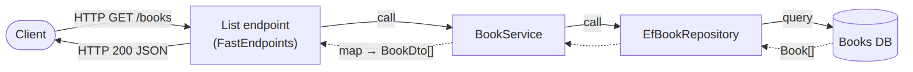

Mermaid source

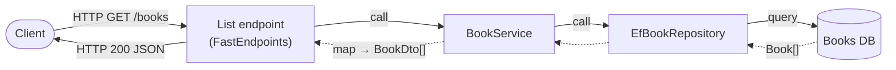

**Reading.** The plain read spine. No command/query object, no MediatR — the
endpoint holds an `IBookService` directly. Mapping to DTO happens in the service.
This is the *minimal* pipeline every other flow is an elaboration of.
`BookEndpoints/List.cs`, `BookService.cs:52`, `EfBookRepository.cs:31`.

## 2. Create Book — the write baseline

Mermaid source

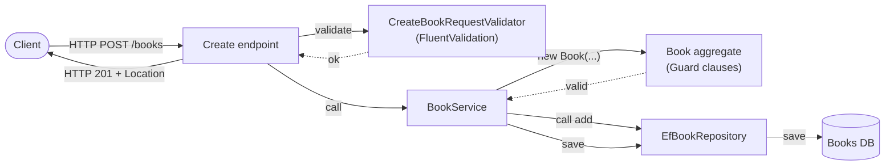

**Reading.** Write baseline. Two validation layers: **request** validation
(FluentValidation, outside the aggregate) and **invariant** validation (Guard
clauses *inside* the `Book` constructor). Still no MediatR. `BookEndpoints/Create.cs`,
`Create.CreateBookRequestValidator.cs`, `Book.cs:12`.

## 3. Add Item to Cart — cross-module *query* to enrich

Mermaid source

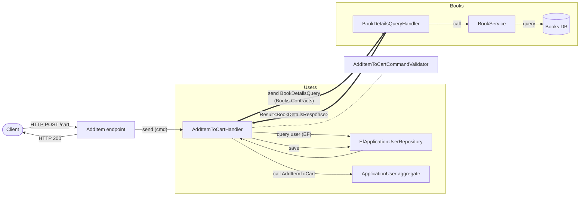

**Reading.** First cross-module hop (bold edges). Users needs book price/title to
build a `CartItem`, but has **no reference to Books** — it `send`s a
`BookDetailsQuery` *defined in `Books.Contracts`*, and MediatR routes it to the
handler living in Books. A cross-module **read**: pull data, then keep working.
`AddItemToCartHandler.cs:30`, `Books.Contracts/BookDetailsQuery.cs`, `Books/Integrations/BookDetailsQueryHandler.cs`.

## 4. Checkout Cart — cross-module *commands* (orchestration)

Mermaid source

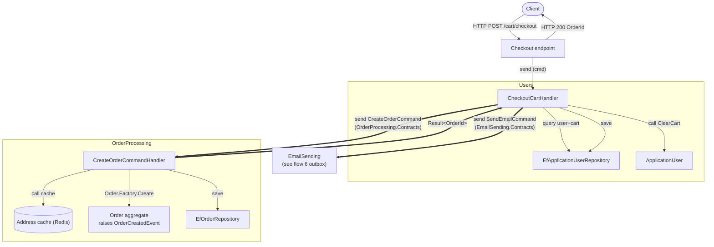

**Reading.** The orchestrator. Two cross-module **commands** (cause effects, vs
flow 3's query): `CreateOrderCommand` into OrderProcessing, `SendEmailCommand` into
EmailSending. Note the ordering invariant — cart is cleared *only after* the order
succeeds. The created `Order` **raises a domain event** (`OrderCreatedEvent`) whose
consequences are flow 6. Code TODO here: the inline `SendEmailCommand` "should move
to an event handler" — i.e. this direct send is a known wart.
`CheckoutCartHandler.cs`, `OrderProcessing.Contracts/CreateOrderCommand.cs`, `OrderProcessing/Integrations/CreateOrderCommandHandler.cs`.

## 5. Add Address → address-cache replication (event-driven)

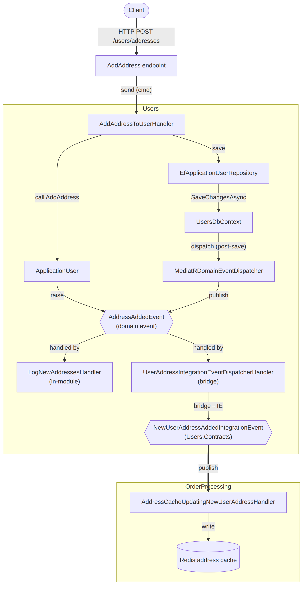

Mermaid source

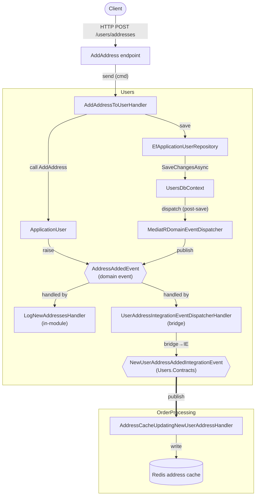

**Reading.** The decoupling pattern. The aggregate **raises** a domain event onto
itself; `UsersDbContext.SaveChangesAsync` **dispatches** it *after* the DB commit
(scanning `ChangeTracker` for `IHaveDomainEvents`). One domain event fans to two
in-module handlers; one of them is a **bridge** that republishes a *Contracts*
integration event, which OrderProcessing consumes to keep a **denormalized Redis
cache** of addresses it needs at order time (so flow 4 can read it synchronously).
Domain event = in-module; integration event = cross-module; the bridge is the seam.
`ApplicationUser.cs:42`, `UsersDbContext.cs:42`, `SharedKernel/MediatRDomainEventDispatcher.cs`, `Users/Integrations/UserAddressIntegrationEventDispatcherHandler.cs`, `OrderProcessing/Integrations/AddressCacheUpdatingNewUserAddressHandler.cs`.

## 6. Order created → fan-out (the richest flow)

Mermaid source

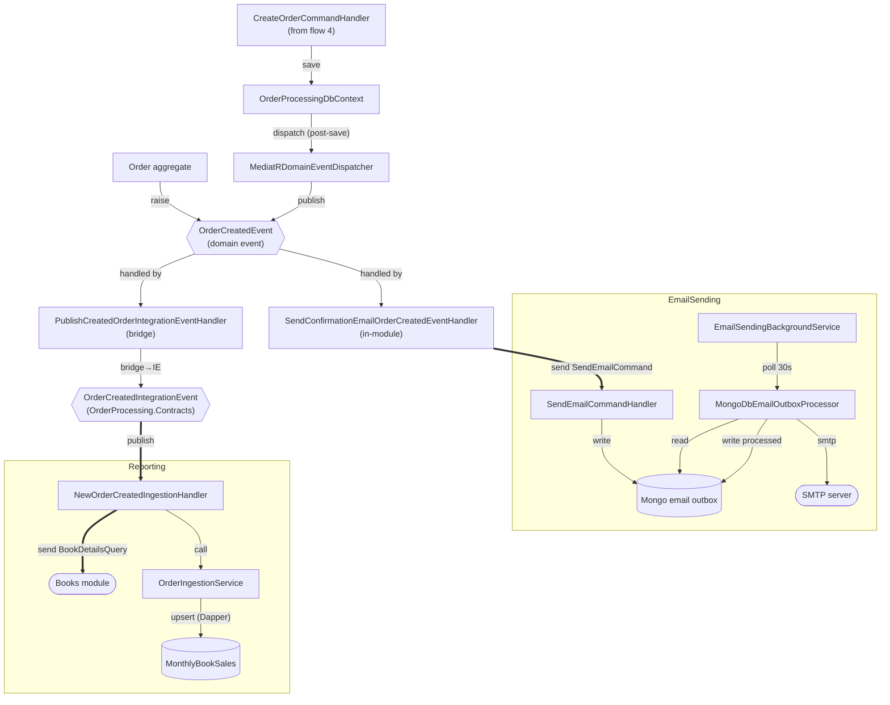

**Reading.** One `raise` → many reactions. The domain event has **two in-module
subscribers**: one queues a confirmation email (cross-module `send` into
EmailSending), one **bridges** to an integration event consumed by **Reporting**.
Two distinct async/decoupling devices appear:
- **Outbox** (EmailSending): the command only *writes a row* to Mongo; a
  `BackgroundService` polls every 30s and does the actual SMTP send, then marks the
  row processed — the HTTP request never waits on email, and a crash just retries.
- **Read-model ingestion** (Reporting): the integration handler enriches via a
  cross-module `BookDetailsQuery` (back into Books) and Dapper-upserts a
  denormalized `MonthlyBookSales` table — its own query-optimized store.

`Order.cs`, `OrderProcessingDbContext.cs:53`, `PublishCreatedOrderIntegrationEventHandler.cs`, `Reporting/Integrations/NewOrderCreatedIngestionHandler.cs`, `EmailSending/SendQueuedEmail/*`.

---

## Coverage audit — did the flows sample *different parts*?

Flows 1–6 were honest but **clustered**: mostly public-HTTP **writes** down the
Users/OrderProcessing/Books spine, plus the two event flows. To check we weren't
only looking at "public services," here is every entry-point *category* in RiverBooks
mapped against the flows that touch it (✓ = covered, — = not).

| Architectural part | F1 | F2 | F3 | F4 | F5 | F6 | F7 | F8 | F9 |
|---|:--:|:--:|:--:|:--:|:--:|:--:|:--:|:--:|:--:|
| Public read (HTTP→service→repo→EF) | ✓ | | | | | | | | |
| Public write (HTTP→aggregate→repo) | | ✓ | ✓ | ✓ | ✓ | | | ✓ | |
| Identity / auth-coupled (Claims) | | | ✓ | ✓ | ✓ | | | ✓ | |
| Cross-module **sync query** | | | ✓ | ✓ | | ✓ | | | |
| Cross-module **sync command** | | | | ✓ | | ✓ | | | |
| Event-driven reactor (no HTTP entry) | | | | | ✓ | ✓ | | | |
| Domain→integration **bridge** | | | | | ✓ | ✓ | | | |
| **Background worker** (poll, no HTTP) | | | | | | ✓ | | | |
| Cache / read-model **write** | | | | | ✓ | ✓ | | | |
| **Projection read** (domain-bypassing) | | | | | | | ✓ | | |
| **Framework-owned write** (Identity) | | | | | | | | ✓ | |
| **Ambient pipeline** (wraps every msg) | | | | | | | | | ✓ |

**Verdict.** Flows 1–6 already reached well past public services — F6 has *no HTTP
entry at all* (internal save-triggered, includes a background worker + domain-only
reactors), and F5/F6 cover the event/bridge plumbing. But three genuinely distinct
parts were unsampled: a **domain-bypassing read**, a **framework-owned write**, and
the **cross-cutting pipeline**. Flows 7–9 fill those.

## 7. Reporting read — projection query (bypasses the domain)

Mermaid source

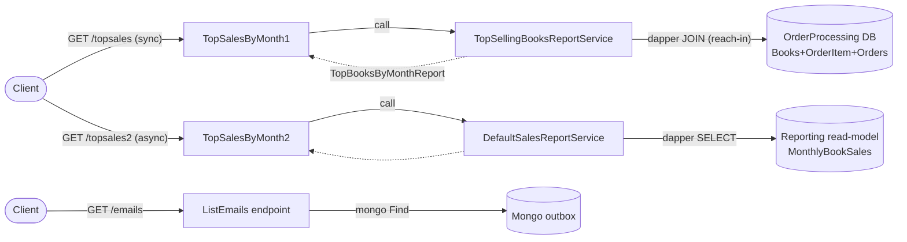

**Reading.** The CQRS **read side**, and the system's clearest deliberate contrast:
the *same* business question answered two ways — **reach-in** (`TopSalesByMonth1`:
synchronous Dapper JOIN straight into the *operational* OrderProcessing tables) vs
**read-model** (`TopSalesByMonth2`: async Dapper `SELECT` against the denormalized
`MonthlyBookSales` projection that flow 6 populates). **Neither touches an aggregate,
repository, EF, or DbContext** — pure SQL→DTO. `ListEmails` (`GET /emails`) is the
NoSQL cousin: the endpoint holds an `IMongoCollection` directly. This whole *part*
is "read a store, shape a DTO" with the domain stack deliberately absent.
`Reporting/ReportEndpoints/TopSalesByMonth{1,2}.cs`, `TopSellingBooksReportService.cs`, `DefaultSalesReportService.cs`, `EmailSending/ListEmailsEndpoint/List.cs:30`.

## 8. Create User — framework-owned write (Identity)

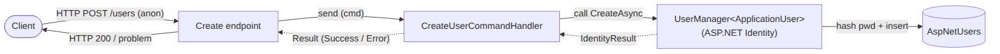

Mermaid source

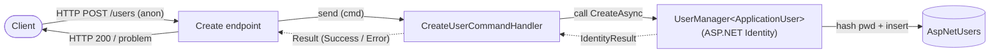

**Reading.** A write that **skips the entire domain discipline** flow 5 uses for the
*same* `ApplicationUser`. No intent-method, no Guard invariants, no repository, no
domain event, no `SaveChangesAsync` of ours — the aggregate is `new`'d as a bare
object and handed to `UserManager`, a **framework service that owns its own rules
(password policy, hashing) and its own store** (`AspNetUsers`). `AllowAnonymous`,
because this is the pre-auth **bootstrap** every other user flow depends on. Same
entity, opposite write discipline — a key un-normalized seam (see §2.5).
`UserEndpoints/Create.cs:26`, `UseCases/User/Create/CreateUserCommandHandler.cs:22`.

## 9. The pipeline band — ambient, wraps every message

Mermaid source

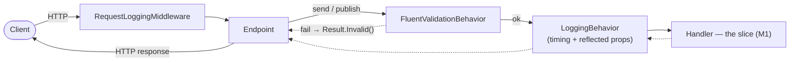

**Reading.** Not a feature — the **band wrapping every other flow**. An HTTP
middleware logs the request; then *inside* MediatR, two pipeline behaviors run before
any handler: `FluentValidationBehavior` runs all registered validators and — the key
finding — **converts failures to `Result.Invalid()` right here**, so the per-slice
validators in flows 2–3 actually execute in this band, not in endpoint code; then
`LoggingBehavior` times the handler. This is the "wrap the unit of work in fixed
structure so it's validated for free" shape, expressed as decorators.
`Web/RequestLoggingMiddleware.cs`, `SharedKernel/FluentValidationBehavior.cs:31`, `SharedKernel/LoggingBehavior.cs`.

---

# Iteration 2 — normalization pass

> Reading the nine graphs side by side, the **same handful of node kinds and edge
> kinds** recur, and they assemble out of a small set of repeating **motifs**. This
> pass names them. Still no grounding on our tech — this is purely "what shapes does
> a well-built feature decompose into."

## 2.1 Normalized node kinds

Every box across all six flows collapses to one of these roles:

| Kind | What it is | Seen as |
|---|---|---|
| **Edge / Endpoint** | the inbound boundary (HTTP today) | `List`, `Create`, `AddItem`, `Checkout`, `AddAddress` |
| **Message** | a typed request the system acts on — *command* (effect) or *query* (data) | `AddItemToCartCommand`, `BookDetailsQuery`, `CreateOrderCommand` |
| **Gate** | a pre-condition check on a message | `*Validator` (request), Guard clauses (invariant) |
| **Handler** | the unit of work for one message; orchestrates, returns a `Result` | every `*Handler` |
| **Service** | stateless behavior a handler/endpoint calls directly | `BookService`, `OrderIngestionService` |
| **Aggregate** | the consistency-owning domain object; exposes intent methods, holds invariants, **emits events** | `Book`, `ApplicationUser`, `Order` |
| **Port + Adapter** | an interface (`I*Repository`, `IOrderAddressCache`, `ISendEmail`) and its impl (`Ef*`, `Redis*`, `MimeKit*`) | repos, caches, senders |
| **Framework service** | an external service that owns *its own* rules **and** store — you call it, it does not go through your aggregate/repo | `UserManager<ApplicationUser>` (Identity) |
| **Pipeline behavior** | an ambient decorator wrapping every message before the handler | `FluentValidationBehavior`, `LoggingBehavior`, `RequestLoggingMiddleware` |
| **Store** | where state lives — *operational* (aggregate-backed) or *projection* (denormalized, read-optimized) | SQL per module, Mongo outbox, Redis cache, Dapper `MonthlyBookSales` read-model |
| **Event** | something that *happened* — **domain** (in-module) or **integration** (cross-module, lives in `*.Contracts`) | `OrderCreatedEvent` / `OrderCreatedIntegrationEvent` |
| **Reactor** | a handler subscribed to an event (incl. the **bridge** reactor that re-emits) | `*EventHandler`, the two bridge handlers |
| **Worker** | a timer-driven background processor | `EmailSendingBackgroundService` |
| **External** | outside the process | SMTP server |

## 2.2 Normalized edge kinds — and the one distinction that matters most

Collapse the legend further and there are really **two transport families**, and
the whole architecture's character comes from where each is used:

| Family | Edges | Cardinality | Coupling | "Who knows whom" |
|---|---|---|---|---|
| **Directed** (ask) | `call`, `send`, `query`/`save` | 1→1 | caller names the message/port | imperative: *do this and tell me the result* |
| **Broadcast** (announce) | `raise` → `dispatch` → `publish` | 1→N | emitter knows nothing of reactors | reactive: *this happened; whoever cares, react* |

The seam between them is the recurring architectural decision. **Inside a slice**
everything is *directed*. **Across slices** there are exactly two sanctioned doors:
a *directed* `send` of a `*.Contracts` message (flows 3, 4 — synchronous, you want
an answer or an ordered effect), or a *broadcast* integration event (flows 5, 6 —
fire-and-forget, the emitter must not wait or care).

There is also a third, *orthogonal* family — **ambient/decorator** (flow 9): the
pipeline band doesn't move data between components, it *wraps* the directed call.
`validate`, `log`, and the `Result.Invalid()` short-circuit are this family. It is
not on the data path; it is the box drawn *around* M1.

## 2.3 The recurring motifs (the reusable shapes)

Nine flows, nine motifs + an ambient band. Every flow is a composition of these:

| Motif | Shape | Appears in |
|---|---|---|
| **M1 · Request pipeline** | `Endpoint → [Gate] → Message → Handler → Result → Endpoint` | all HTTP |
| **M2 · Aggregate mutation** | `Handler → (load via Port) → Aggregate.intent() [guards (+raise)] → save` | 2,3,4,5,6 |
| **M3 · Cross-module ask** | `Handler → send(Contracts msg) → foreign Handler → Result` | 3 (query), 4 (command) |
| **M4 · Post-save dispatch** | `Aggregate.raise → DbContext.save → dispatch → publish → Reactor*` | 5,6 |
| **M5 · Domain→Integration bridge** | `Reactor → bridge→IE → foreign Reactor*` | 5,6 |
| **M6 · Async outbox** | `Handler → write(outbox); Worker → poll → read → External → mark` | 6 |
| **M7 · Read-model / cache replication** | `Reactor → upsert(own denormalized Store)` | 5 (Redis), 6 (Dapper) |
| **M8 · Projection read** | `Endpoint → Service → store query (Dapper) → DTO` — **no aggregate/repo/EF** | 7 (+ ListEmails) |
| **M9 · Framework-owned write** | `Handler → Framework service → its own store` — replaces M2's aggregate/repo/event | 8 |
| **(band) · Ambient pipeline** | `Middleware → Validate(→short-circuit) → Log → Handler` **wraps** M1 | 9 (around 2–6,8) |

Notice the **layering**: M4 feeds M5 feeds (M6 ∥ M7). The right edge of one motif is
the left edge of the next — they chain at typed seams (a `Result`, an event, a
`*.Contracts` type). That chaining-at-seams is the thing to carry forward. M8/M9 are
*alternative cores* — they occupy M2's slot but deliberately drop the domain stack
(M8 for reads, M9 for framework-owned writes). The band is not in series at all; it
encloses M1.

## 2.4 The canonical composite

Collapsing all nine onto the normalized vocabulary, **one feature** looks like this —
the ambient **band** encloses the request; M1 is the spine; the **core** is normally
M2 but M8/M9 are drop-in alternatives; M3 branches sideways (sync); M4→M5→{M6,M7}
hangs off the bottom (async):

Mermaid source

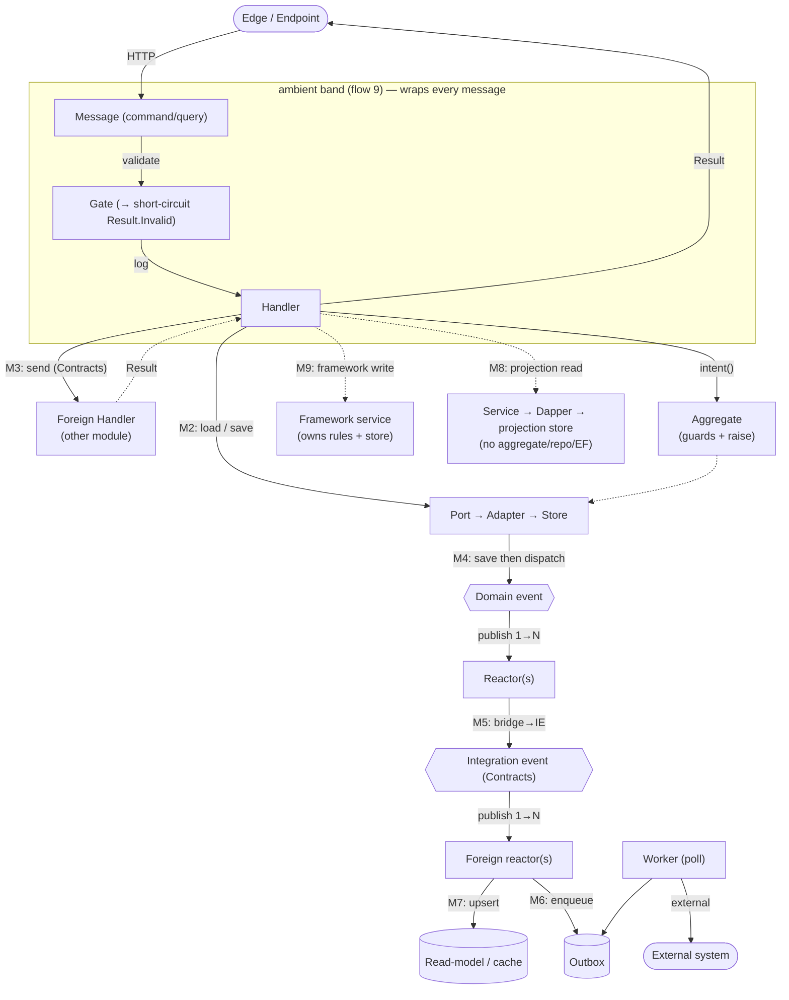

## 2.5 What's *not* normalized (the signal)

Where the reference itself is inconsistent is exactly where a normalizing system
earns its keep:

1. **Two pipeline dialects.** Books = `Endpoint → Service → Repo` (no message bus);
   Users/OrderProcessing = `Endpoint → Message → Handler`. Same M1 intent, two
   spellings. A normalized model would pick one (or treat "Service" as a degenerate
   handler).
2. **Two emit-paths for one side-effect.** Email is triggered both by a direct
   `send` from Checkout (flow 4) *and* by an OrderCreated reactor (flow 6) — the
   code even TODOs the first toward the second. The normalized rule is latent:
   *side-effects of a state change belong on M4 (the event), not inline in the
   originating handler.*
3. **Gate placement varies.** Request validation (FluentValidation) vs invariant
   validation (Guard clauses in the ctor) are both "Gate" but live at different
   altitudes. Worth a single model with two tiers rather than two mechanisms.
4. **Cross-module door choice is by convention, not by type.** "Use `send` for a
   needed answer, an integration event for fire-and-forget" is a rule in people's
   heads — nothing structural enforces which door a given interaction should take.
5. **One entity, two write disciplines.** `ApplicationUser` is mutated through the
   full aggregate+event machinery in flow 5 (AddAddress) but created through a bare
   `UserManager` call in flow 8 — no guard, no event. Framework-owned writes (M9)
   are a real exception to M2, but nothing marks *which* entities/operations are
   allowed to take it.
6. **Read side has its own un-normalized spread.** Reads appear as: M1+service+repo
   (flow 1), reach-in Dapper into operational tables (flow 7a), Dapper over a
   denormalized projection (flow 7b), and a raw Mongo `Find` in the endpoint
   (ListEmails). Four spellings of "get data out," chosen ad hoc.

## 2.6 Carry-forward (for the later grounding pass — not done here)

- The unit of reuse is the **motif** (M1–M7), not the file. A feature is *a
  composition of motifs chained at typed seams*.
- The two transport families (§2.2) and the two cross-module doors (§2.3/M3,M5) are
  the **load-bearing decisions** — any architecture model we build should make those
  choices explicit and, ideally, type-enforced rather than conventional.
- The inconsistencies in §2.5 are candidate **invariants to enforce**, not bugs to
  copy.

> Next pass (separate): hold these motifs against our own composition/template model
> and see which fall out for free, which need a new mechanism, and which of the §2.5
> inconsistencies our type system could make unrepresentable.
