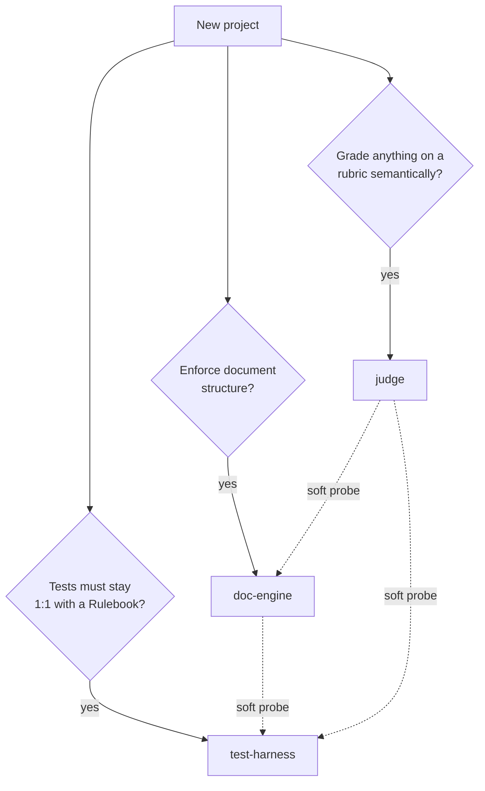

# Importing the engines into a new project

How to lift the three enforcement engines out of this repo and stand them up in
another one. Each step maps to an executable spike here — run the spike to see the
seam work, then follow "in a real home" to land it.

Full analysis: [`PLANS/doc-engine-extraction.research.md`](../PLANS/doc-engine-extraction.research.md).

## The three engines (one shared model, three enforcers)

Per ADR 0015 ("rulebook-as-document") the pillars share the *model* and detect each
other by runtime probe — never a project reference. Unify the model, not the engine.

| Engine | Enforces | Kind | Depends on |
|---|---|---|---|
| **doc-engine** | one document conforms to its doctype (structural) | hard, intra-document | YamlDotNet only |
| **test-harness** | Rulebook headers ↔ `[Rule]` tests stay in lockstep (cross-artifact) | hard | doc-engine *optionally*, at the process boundary |
| **judge** | an artifact meets a semantic rubric | soft | nothing (both others soft-depend on *it*) |

## Which engines do you need?



Take only what you need. They compose, but none requires the others to run.

## Import order

Import **judge → doc-engine → test-harness**. The judge depends on nothing and the
other two soft-probe for it, so it lands first; the harness soft-probes the
doc-engine, so it lands last.

| # | Engine | Spike to run first | What travels |
|---|---|---|---|
| 1 | judge | [`judge-packaging/`](judge-packaging) | a `.claude/` bundle (agent + workflow + adapters) |
| 2 | doc-engine | [`doc-engine-packaging/`](doc-engine-packaging) | a `dotnet tool` (`docengine`) with its catalog baked in |
| 3 | test-harness | [`test-harness-packaging/`](test-harness-packaging) | a renamed `[Rule]` + `ParityGuard` library + a consumer suite |

Prereqs: .NET 10 SDK; Node (for the judge workflow); a repo with `git`.

---

## 1. judge — the portable rubric evaluator

The core (`agents/judge.md` + `workflows/judge.js`) is topic-blind and carries zero
host tokens; only the adapters (skill/commands) name a host taxonomy.

```
bash spikes/judge-packaging/verify.sh   # PASS — core lifts verbatim; adapters isolated as the seam
```

**In a real home:**

| Step | Action |
|---|---|
| Copy the core verbatim | `bundle/.claude/agents/judge.md`, `bundle/.claude/workflows/judge.js` → your `.claude/` |
| Keep the contract | callers send `{subject, context, files?, criteria:[{id, description, howToCheck?}]}`; judge returns `{generalFeedback, results:[{criterionId, status, evidence}]}` |
| Re-author the adapters | `commands/judge*.md` + `skills/test-rulebook/SKILL.md` name *your* taxonomy — rewrite these, not the core |

See [`judge-packaging/MANIFEST.md`](judge-packaging/MANIFEST.md) for the core-vs-adapter split.

## 2. doc-engine — the installable document checker

Ships as `dotnet tool` `docengine` with the catalog (`_schema`/`kinds`/`blocks`/`doctypes`)
riding inside the package. One resolver serves two modes.

```
bash spikes/doc-engine-packaging/pack-and-run.sh   # PASS — packs, installs, enforces from a catalog-less dir
```

### The two catalog modes — pick one

| Mode | Catalog lives | You can author | Use when |
|---|---|---|---|
| **Enforce-only** | baked read-only in the tool | instances of a fixed vocabulary | the repo just wants document checks |
| **Authoring** | checked-in editable YAML, `docengine --root ./doc-catalog` | instances **+ blocks + doctypes** | the repo owns and extends its own vocabulary |

Same binary. Resolution order: explicit `--root` → walk up from CWD for
`_schema/kind.schema.yaml` → catalog baked in the tool. Authoring **requires** the
editable mode — you cannot edit a catalog sealed in a `.nupkg`.

**In a real home:**

| Step | Action |
|---|---|
| Pack + publish | the `Engine/` csproj already has `PackAsTool` / `ToolCommandName=docengine` / catalog as `<Content>`; `dotnet pack`, push to your feed |
| Install | `dotnet tool install --tool-path ./.tools ABox.DocEngine.Tool` (or global) |
| Enforce-only | run `docengine check` / `docengine validate <file>` — the baked catalog answers |
| Authoring | check the catalog in as editable YAML and point every call at it with `--root ./doc-catalog` |

The **only** two changes over the in-repo engine are `PackAsTool`+catalog-`<Content>`
in the csproj and one `AppContext.BaseDirectory` fallback in `ResolveRoot`; every `.cs`
and the whole catalog are byte-identical. See [`doc-engine-packaging/README.md`](doc-engine-packaging/README.md).

### Authoring new vocabulary (only if you took the authoring mode)

New structure is **data, not code** — "the engine names no kind."

```
bash spikes/doc-engine-authoring/run.sh   # PASS — new block + doctype authored as YAML; instances enforced
```

| Level | Change | Command that gates it |
|---|---|---|
| Instance | a new `*.md` document | `catalog <doctype>` (discover) → `validate` → judge on `rubric` |
| Block | a new `blocks/<type>.yaml` (+ list it in a doctype) | `check` |
| Doctype / kind | a new `doctypes/<name>.yaml` or `kinds/<x>.yaml` | `check` |

The `create-doc` bundle ([`doc-engine-authoring/bundle/`](doc-engine-authoring/bundle))
travels alongside — a topic-blind author agent that reads the catalog at runtime.

## 3. test-harness — the parity pillar

Lifts off this repo's identity: the `ParityGuard` logic moves verbatim, the
hardcoded `ABox.slnx` marker becomes a parameter, and your test content is
re-authored.

```
bash spikes/test-harness-packaging/run.sh   # PASS — 6 tests: parity + marker seam + optional doc-engine edge
```

| Layer | What you do |
|---|---|
| Engine moves verbatim | copy `Harness/ParityGuard.cs`, `RuleAttribute.cs`, `TestMarkers.cs`; rename the namespace (`ABox.Tests.Harness` → yours) |
| Seams find/replace | pick your root marker via `RepoRoot.LocateBy("<your.marker>", …)`; point the Rulebook at your suite via the `RulebookDir` metadata seam |
| Content re-authored | write your own `Rulebook.md` (`### ` headers) + `[Rule]`-cited `[Fact]`s per the `Sample/` shape |

**In a real home:** stamp `<AssemblyMetadata Include="RulebookDir" Value="$(MSBuildProjectDirectory)" />`
in the consumer csproj; assert parity with `ParityGuard.For(assembly, "Rules").Assert()`.
See [`test-harness-packaging/README.md`](test-harness-packaging/README.md).

---

## Wiring the pillars together (soft, never hard)

A pillar detects a sibling by probing the process boundary at runtime — never by a
project reference. Present → the extra check turns on; absent → it degrades, never a
hard failure.

```sh
if command -v docengine >/dev/null 2>&1; then
  docengine validate "$doc" || exit 1     # hard document check ON
fi                                         # absent → skip, parity/judge stand undiminished
```

The dependency arrow only ever points **test-engine → doc-engine**, never the reverse.
Never merge two pillars into one.

## Layer 3 — making conformance mandatory across the repo

Validating one document is the engine's job (`check`, `validate`). Making *every*
document stay valid repo-wide is a separate, replaceable driver — a CI step, a git
hook, or a test. It is not part of the engine.

```
bash spikes/doc-engine-authoring/gate.sh   # PASS — discovers every instance, blocks on any drift
```

`gate.sh` is a harness-free driver: it discovers every `*.md` opening with a
`docType:` front-matter block and `validate`s each against the catalog, exiting
non-zero (and naming the offender) on any drift. Drop it into CI as-is, or, if you
took the test-harness, express the same net as a `Docs` test that shells the engine.

## Verification checklist

Run each engine's spike; all print `PASS`. Then, in your new home:

- [ ] `docengine check` — catalog self-consistent
- [ ] `docengine validate <good>` passes; `validate <bad>` exits non-zero (teeth)
- [ ] parity suite green; an uncited `[Fact]` in scope fails the guard (teeth)
- [ ] judge returns a per-criterion verdict for a sample rubric
- [ ] layer-3 gate blocks a drifted instance in CI

## What a real cutover repoints (protected paths — out of scope for the spikes)

The spikes perturb nothing here. A real extraction repoints, in this repo:
`tests/Central/Docs/Support/DocEngine.cs` (installed tool, not `dotnet run --project`),
`on-doc-change.sh`, the `.claude/create-doc` path, `dirs.proj`,
`governance/protected-paths`, and the client export. Those are protected paths and a
real new home — route them through a reviewed PR.

---

*These spikes are proofs, not production. They live outside `ABox.slnx` / `dirs.proj`
and are deleted once the real extraction lands.*
